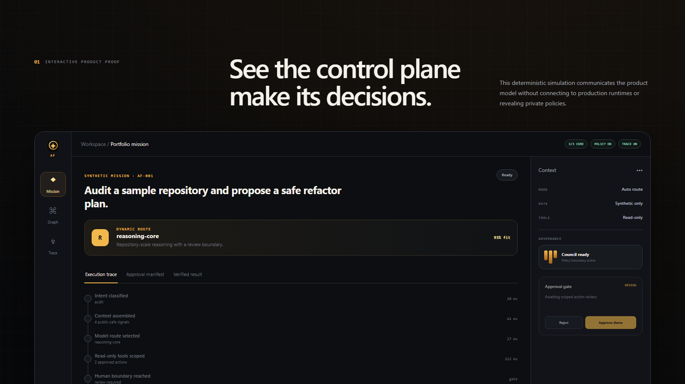
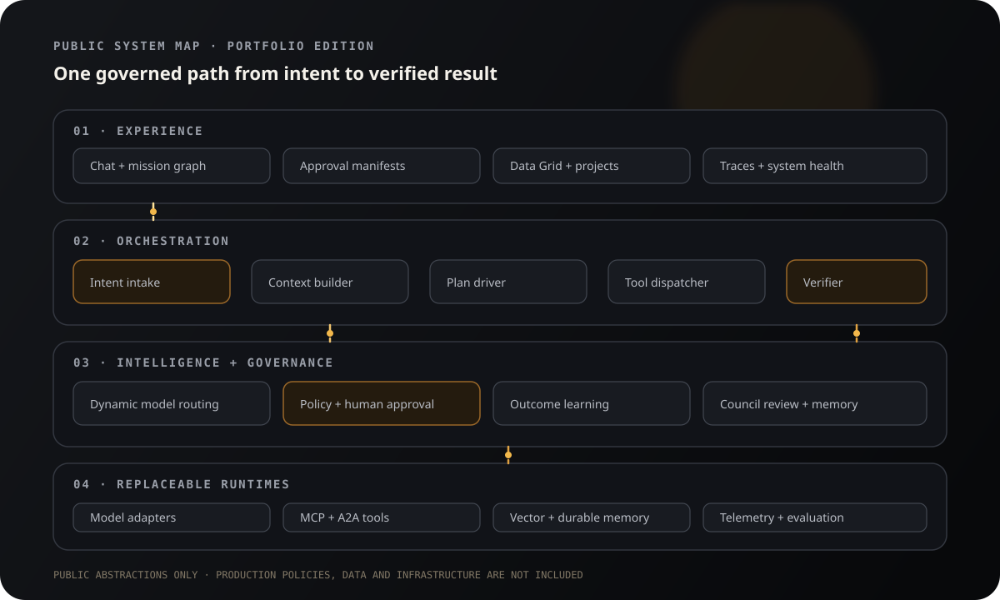
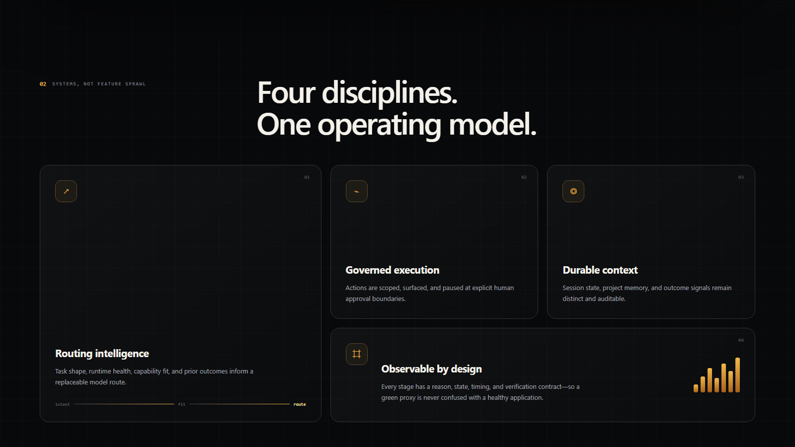
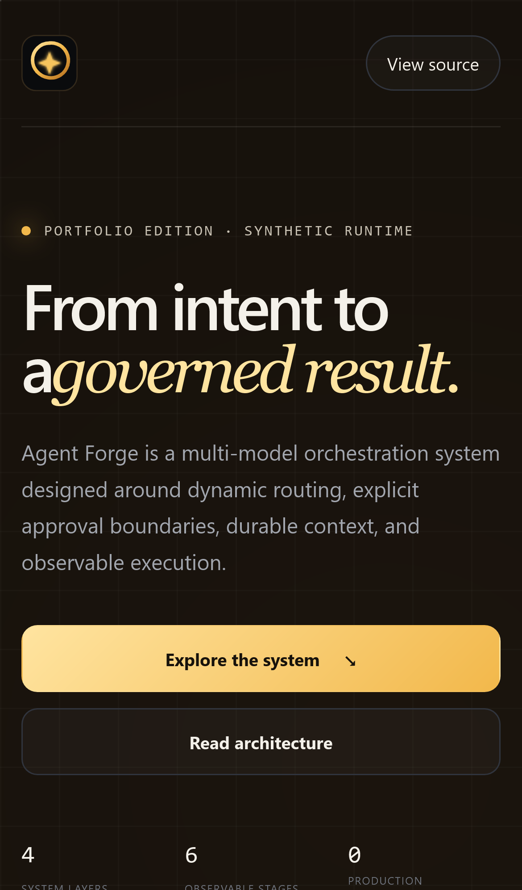

<div align="center">
  

  # Agent Forge

  ### Governed multi-model orchestration—from intent to verified result.

  **A curated, synthetic portfolio edition of a private production system.**

  [](https://github.com/Prashant10009/agent-forge-showcase/actions/workflows/ci.yml)
  [](https://github.com/Prashant10009/agent-forge-showcase/actions/workflows/codeql.yml)
  [](https://prashant10009.github.io/agent-forge-showcase/)
  [](LICENSE)

  [**Explore the interactive demo**](https://prashant10009.github.io/agent-forge-showcase/) · [Read the architecture](docs/ARCHITECTURE.md) · [Inspect the public boundary](docs/PUBLIC_BOUNDARY.md)
</div>



## What this repository demonstrates

Agent Forge is designed as a control plane for AI work: it interprets intent, assembles context, selects a fitting runtime, scopes tool use, pauses at policy boundaries, and records enough evidence to verify the result.

This repository showcases the system relationships and product judgment without publishing the production implementation.

| System | What you can evaluate here |
|---|---|
| **Routing intelligence** | A task-aware, replaceable route abstraction with a visible selection reason |
| **Governed execution** | Scoped manifests and an explicit human approval boundary before simulated writes |
| **Durable context** | Separation of mission, route, tool, policy, and verification state |
| **Observability** | Stage-by-stage traces with state, timing, and a verification contract |

## Three-minute reviewer path

1. Open the [interactive product tour](https://prashant10009.github.io/agent-forge-showcase/).
2. Run the synthetic mission and approve or reject its manifest.
3. Read the [architecture narrative](docs/ARCHITECTURE.md).
4. Inspect the [deterministic demo engine](demo/engine.mjs), [tests](tests/demo.test.mjs), and [CI boundary gate](scripts/check-public-boundary.mjs).

## System map



The public model has four layers:

1. **Experience** — chat, mission graph, approvals, Data Grid concepts, traces, and health.
2. **Orchestration** — intake, context, planning, tool dispatch, and verification.
3. **Intelligence + governance** — dynamic routing, policy boundaries, outcome learning, council review, and memory.
4. **Replaceable runtimes** — model adapters, tool protocols, durable memory, and telemetry.

The production algorithms, routing weights, prompts, infrastructure, and data remain private by design.

## Interactive proof, not a marketing mock

The demo is deterministic and uses no external provider calls. It exposes a real UI state machine for:

```text
intent → context → route → scoped tools → approval → verification
```

- Run a synthetic codebase-audit mission.
- Watch the execution trace advance.
- Inspect the proposed action manifest.
- Approve or reject at the governance boundary.
- See the terminal result reflect that decision.



<details>
  <summary><strong>Responsive interface proof</strong></summary>
  <br>
  
</details>

## Run locally

Requirements: Node.js 20 or newer. No API keys or production services are needed.

```bash
git clone https://github.com/Prashant10009/agent-forge-showcase.git
cd agent-forge-showcase
npm install
npm run check
npm run serve
```

Then open `http://localhost:4173/site/`.

## Engineering decisions worth inspecting

- [Architecture](docs/ARCHITECTURE.md) — boundaries, lifecycle, and system responsibilities.
- [Engineering notes](docs/ENGINEERING_NOTES.md) — why the public edition is documentation-first and deterministic.
- [Threat model](docs/THREAT_MODEL.md) — publication and demo risks with mitigations.
- [Public boundary](docs/PUBLIC_BOUNDARY.md) — what is intentionally included and excluded.
- [Roadmap](docs/ROADMAP.md) — portfolio-edition improvements without production scope expansion.
- [CI](.github/workflows/ci.yml) — tests, link checks, and repository-content policy.
- [CodeQL](.github/workflows/codeql.yml) — static security analysis for the public JavaScript.

## Public/private boundary

| Included | Private by design |
|---|---|
| Original synthetic interface | Production application source |
| High-level system architecture | Routing weights and proprietary policies |
| Deterministic demo engine | Private prompts and agent instructions |
| Synthetic fixtures and traces | Customer, founder, runtime, or telemetry data |
| Verification and publication checks | Infrastructure details and operational runbooks |

See [PUBLIC_BOUNDARY.md](docs/PUBLIC_BOUNDARY.md) for the enforceable rules.

## Repository quality

The public repository uses:

- GitHub Actions for test, link, and public-boundary checks;
- CodeQL and dependency review;
- Dependabot for npm and Actions;
- GitHub Pages for the static tour;
- issue forms, pull-request controls, CODEOWNERS, security policy, and releases;
- a fresh Git history unrelated to the private production repositories.

## Author

Built and architected by **Prashant Dimri** as part of the Agent Forge product program. AI systems supported design review, testing, and implementation; product ownership and publication decisions remain human-owned.

## License

The content and code in **this public showcase repository only** are available under the [MIT License](LICENSE). The license does not apply to any private Agent Forge repository, service, model policy, dataset, prompt library, or production implementation.
