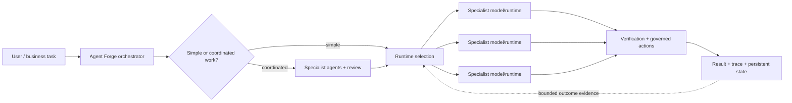

<p align="center">
  <a href="https://myagentforge.ai/">
    
  </a>
</p>

<p align="center">
  <strong>ONE AI SHOULD NOT HAVE TO DO EVERYTHING.</strong><br>
  <sub>Agent Forge coordinates agents, specialist models, tools, memory, and governed actions through one orchestration layer.</sub>
</p>

<p align="center">
  <a href="https://myagentforge.ai/"><strong>WEBSITE</strong></a>
  &nbsp;|&nbsp;
  <a href="https://myagentforge.ai/tour_factual.html#demo"><strong>PRODUCT TOUR</strong></a>
  &nbsp;|&nbsp;
  <a href="docs/PRODUCTION_CAPABILITIES.md"><strong>PRODUCTION CAPABILITIES</strong></a>
  &nbsp;|&nbsp;
  <a href="docs/ARCHITECTURE.md">ARCHITECTURE</a>
  &nbsp;|&nbsp;
  <a href="docs/PUBLIC_CORE.md">RUNNABLE CORE</a>
  &nbsp;|&nbsp;
  <a href="docs/QUALITY_EVIDENCE.md">QUALITY EVIDENCE</a>
</p>

---

## The idea

Thousands of models and specialist runtimes are being built for coding, reasoning, research, documents, media, vision, business workflows, and domain-specific work. Agent Forge is built around a simple premise:

**agents have responsibilities; models are execution resources.**

A coding agent should not permanently *be* one model. A research agent should not permanently *be* another. The role can stay stable while the orchestration layer selects a compatible execution resource using capability, health, availability, limits, cost, latency, and bounded outcome evidence.

Agent Forge turns that idea into a system that can classify a request, assemble context, coordinate specialist agents, select runtimes, govern consequential actions, verify results, persist state, and learn from outcomes without treating any single model as the whole product.



The important separation is between **role**, **execution**, and **authority**. The agent defines responsibility. The routing layer chooses where work should run. Governance controls what the selected runtime is allowed to do. Verification determines whether the result can be accepted.

## What exists in production

The deployed product includes responsibilities for multi-model orchestration, evidence-aware routing, specialist-agent coordination, persistent context, review, tool governance, cost controls, failure handling, observability, interoperability, structured outputs, and artifact verification.

Three Agent Forge concepts make the intelligence layer easier to reason about publicly:

- **Trimurti** — bounded multi-perspective review for selected significant work.
- **Karma** — outcome evidence used to inform later execution decisions without becoming unquestioned truth.
- **RTA signals** — additional context for selecting an execution slot independently of the agent role.

The exact production prompts, routing policy, weights, thresholds, learned parameters, provider inventory, credentials, and operational configuration remain private. The public capability map explains the system at the level appropriate for external review: [Production capabilities](docs/PRODUCTION_CAPABILITIES.md).

For a concrete but fully synthetic example, inspect [`examples/specialist_routing_trace.json`](examples/specialist_routing_trace.json). It shows one agent role evaluated against abstract execution resources, followed by governed authority, verification, and bounded feedback without exposing production policy.

## What you can inspect here

This repository is not a screenshots-only portfolio. It contains an independently authored, provider-neutral implementation of the central Agent Forge control-plane pattern so reviewers can execute the architecture without receiving the private production engine.

| What to evaluate | Public evidence |
|---|---|
| Product thesis | Multi-model specialist routing with agents separated from models |
| System design | Request lifecycle, routing, review, tools, state, governance, and verification |
| Executable engineering | Runnable public control plane with typed contracts and deterministic fixtures |
| Reliability | Failure model, deadlines, fallback, circuits, terminal-state rules, and artifact checks |
| Quality | Python contract tests, repository tests, CI, CodeQL, dependency review, and release checks |
| Production depth | Sanitized capability map, codebase map, authentic product captures, and dated structural inventory |

## Start here

1. Visit [myagentforge.ai](https://myagentforge.ai/) for the product thesis and existing product surface.
2. Walk the [existing product tour](https://myagentforge.ai/tour_factual.html#demo) for the real shell with labeled sample data.
3. Read [Production capabilities](docs/PRODUCTION_CAPABILITIES.md) and [Architecture](docs/ARCHITECTURE.md) to understand how Agent Forge separates agents, runtimes, governance, and evidence.
4. Inspect the [synthetic specialist-routing trace](examples/specialist_routing_trace.json), then run the [provider-neutral public core](docs/PUBLIC_CORE.md).
5. Inspect the [system walkthrough](docs/SYSTEM_WALKTHROUGH.md), [quality evidence](docs/QUALITY_EVIDENCE.md), [failure model](docs/FAILURE_MODEL.md), and repository automation.

## Run the public core

The Python package under [`src/agent_forge_public`](src/agent_forge_public) is a working reference implementation of the public lifecycle. Its canonical control-plane path includes typed contracts, tenant-scoped state, bounded review, evidence routing, circuits, deadlines, budget reservation, capacity claims, compatible fallback, exact-action approval manifests, immutable artifact verification, outcome feedback, terminal stream semantics, task-state vector boundaries, protocol capability envelopes, and dependency-aware workflow scheduling.

```bash
python -m pip install -e .
agent-forge-public route "Implement and verify a Python parser"
agent-forge-public demo --action write --approve "Implement and verify a Python parser"
agent-forge-public lab all
python -m unittest discover -s tests_python -v
```

It has no external package dependency, account requirement, provider credential, network call, or production configuration. The full module map is in [docs/PUBLIC_CORE.md](docs/PUBLIC_CORE.md); the production-concern-to-public-evidence rationale is in [docs/PUBLIC_IMPLEMENTATION_MAP.md](docs/PUBLIC_IMPLEMENTATION_MAP.md). A compact [sanitized event trace](examples/governed_trace.json) lets reviewers inspect a complete governed lifecycle without running the CLI.

## The existing product

The website and tour are the canonical product surfaces. This repository documents and demonstrates the engineering behind them rather than rebuilding a second UI.


<details>
  <summary><strong>Open the orchestration comparison from the website</strong></summary>
  <br>
  
</details>

## Private codebase, public evidence

Read-only inventory captured on 2026-08-15:

| Measure | Count |
|---|---:|
| Tracked files | 525 |
| Source files | 395 |
| Python modules | 343 |
| JavaScript / TypeScript modules | 41 |
| HTML / CSS surfaces | 12 |
| Test files | 136 |

Responsibility groups include:

- **Experience:** API, chat, projects, files, Data Grid, and browser product surfaces.
- **Orchestration:** pipelines, routing, agents, architecture work, and tool dispatch.
- **Intelligence:** Karma evidence, Trimurti review, RTA signals, evaluation, and scoring.
- **State:** database, storage, memory, vector retrieval, sessions, and checkpoints.
- **Runtimes:** model clients, provider integrations, optional user runtimes, vision, and fine-tuning support.
- **Trust:** safety boundaries, permissions, approvals, traces, and observability.

The detailed public map is in [docs/CODEBASE_MAP.md](docs/CODEBASE_MAP.md). This dated snapshot includes 90,937 lines of Python in the main application package and 23,411 lines across 119 Python test files. Those counts communicate scale; the map describes responsibilities rather than proprietary implementations.

## Why the production engine remains private

The value of a public showcase is to make the architecture and engineering inspectable, not to publish credentials, customer/runtime data, operational configuration, private prompts, or the learned policy that determines production behavior.

This repository therefore publishes architecture, responsibility maps, authentic public visuals, selected engineering decisions, deterministic reference code, tests, and repository automation while keeping the production application and its history private.

| Public here | Private by design |
|---|---|
| Architecture and responsibility maps | Production application source and Git history |
| Sanitized production capability descriptions | Prompts, policies, weights, thresholds, and learned parameters |
| Provider-neutral reference core and tests | Proprietary adapters and runtime-selection implementation |
| Authentic public product captures | Authenticated application bundles and private product state |
| Repository checks and security controls | Credentials, internal configuration, private traces, and customer/session data |

The enforceable rules are documented in [docs/PUBLIC_BOUNDARY.md](docs/PUBLIC_BOUNDARY.md).

## Repository signals

[](https://github.com/Prashant10009/agent-forge-showcase/actions/workflows/ci.yml)
[](https://github.com/Prashant10009/agent-forge-showcase/actions/workflows/codeql.yml)

Every pull request runs:

```text
repository tests -> Python 3.11/3.12 tests -> compile/package smoke -> public-boundary scan -> links -> dossier -> JavaScript/Python CodeQL
```

The repository also uses dependency review, Dependabot, protected `main`, code-owner review, secret scanning, push protection, build artifacts, issue forms, pull-request templates, and tagged releases.

```bash
npm ci
npm run check
```

## Brand continuity

The public repository follows the established Agent Forge identity: dark, sharp, fire palette, alive but controlled. The triangular flame/A mark, real website imagery, product language, and **Burning Within** signature come from the existing brand system.

Browse the public SVG variants in the [official logo asset index](assets/brand/README.md), and see [brand identity notes](docs/BRAND_IDENTITY.md) for usage rules.

## Author and ownership

Agent Forge is built and architected by **Prashant Dimri**. AI systems support research, implementation, review, and testing; product direction and publication decisions remain human-owned.

Repository code and documentation are covered by [LICENSE](LICENSE). The Agent Forge name, logo, and brand identity are covered by [TRADEMARKS.md](TRADEMARKS.md); no trademark rights are granted by the software license.
