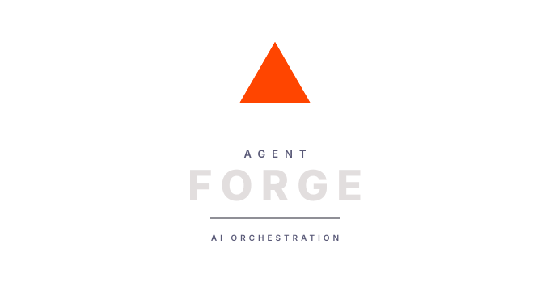
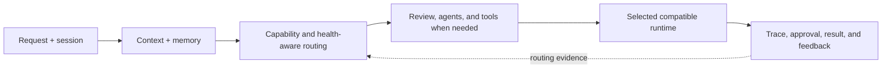

<div align="center">
  

  # Agent Forge

  ### Burning Within

  **Engineering dossier for a private, production multi-model AI workspace.**

  [](https://github.com/Prashant10009/agent-forge-showcase/actions/workflows/ci.yml)
  [](https://github.com/Prashant10009/agent-forge-showcase/actions/workflows/codeql.yml)
  [](https://myagentforge.ai/)

  [**Website**](https://myagentforge.ai/) · [**Existing product tour**](https://myagentforge.ai/tour_factual.html#demo) · [Architecture](docs/ARCHITECTURE.md) · [Codebase map](docs/CODEBASE_MAP.md) · [Brand](docs/BRAND_IDENTITY.md)
</div>


## What this repository is

This is the public GitHub representation of Agent Forge: a place to understand the product, architecture, private codebase shape, engineering decisions, verification discipline, and publication boundary.

The website and interactive tour already exist. This repository links to and documents those real surfaces; it does not rebuild them or publish a second interface.

| Evaluate | Evidence here |
|---|---|
| Product judgment | Real website and tour captures, workflows, positioning, and operator controls |
| System design | Request lifecycle, package map, routing, review, tools, state, and observability |
| Engineering depth | Verified codebase snapshot, architecture notes, threat model, and decision records |
| Delivery discipline | CI, CodeQL, dependency review, Dependabot, protected branches, and releases |
| Publication judgment | Explicit public/private boundary with automated leak scanning |

## Ten-minute reviewer path

1. Open [myagentforge.ai](https://myagentforge.ai/).
2. Walk the existing [interactive tour](https://myagentforge.ai/tour_factual.html#demo).
3. Read the [architecture](docs/ARCHITECTURE.md) and [codebase map](docs/CODEBASE_MAP.md).
4. Inspect the [public-boundary gate](scripts/check-public-boundary.mjs) and [repository tests](tests/repository.test.mjs).
5. Review Actions, security configuration, releases, issues, and dependency updates.

## Product in one flow



Runtime selection, execution authority, and result verification remain separate concerns.

## Existing product surfaces

The public website explains why Agent Forge exists and how work moves through it. The existing tour presents the real product shell using clearly labeled sample data.


<details>
  <summary><strong>Website orchestration comparison</strong></summary>
  <br>
  
</details>

## Private codebase snapshot

Read-only inventory captured on 2026-08-15:

| Measure | Count |
|---|---:|
| Tracked files | 523 |
| Source files | 394 |
| Python modules | 341 |
| JavaScript / TypeScript modules | 41 |
| HTML / CSS surfaces | 12 |
| Test files | 136 |

Responsibility groups include:

- **Experience:** API, chat, projects, files, Data Grid, and browser product surfaces.
- **Orchestration:** pipelines, routing, agents, architecture work, and tool dispatch.
- **Intelligence:** Karma evidence, Trimurti review, Rta signals, evaluation, and scoring.
- **State:** database, storage, memory, vector retrieval, sessions, and checkpoints.
- **Runtimes:** model clients, provider integrations, optional user runtimes, vision, and fine-tuning support.
- **Trust:** safety boundaries, permissions, approvals, traces, and observability.

## Public/private boundary

This repository does not publish production source, Git history, prompts, routing weights, thresholds, credentials, provider inventories, operational configuration, private sessions, evaluation data, or authenticated application bundles.

It publishes system responsibilities, authentic public visuals, codebase structure, engineering decisions, and inspectable repository automation. See [PUBLIC_BOUNDARY.md](docs/PUBLIC_BOUNDARY.md).

## Repository automation

Every pull request runs:

```text
repository tests → public-boundary scan → link validation → dossier build → CodeQL
```

The repository also uses dependency review, Dependabot, protected `main`, code-owner review, secret scanning, push protection, build artifacts, and tagged releases.

```bash
npm ci
npm run check
```

Repository metadata and documentation point to the existing website and tour; no second public site is deployed from this repository.

## Author and ownership

Agent Forge is built and architected by **Prashant Dimri**. AI systems support research, implementation, review, and testing; product direction and publication decisions remain human-owned.

Repository code and documentation are covered by [LICENSE](LICENSE). The Agent Forge name, logo, and brand identity are covered by [TRADEMARKS.md](TRADEMARKS.md); no trademark rights are granted by the software license.
