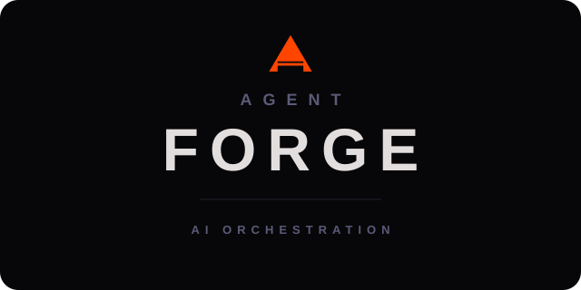
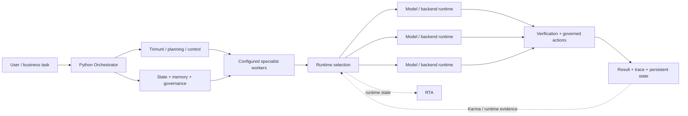
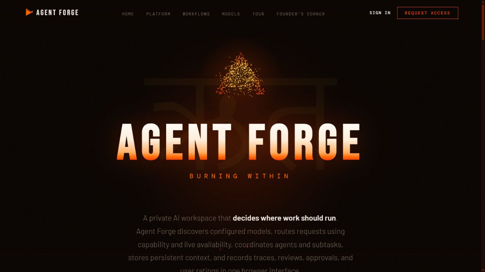
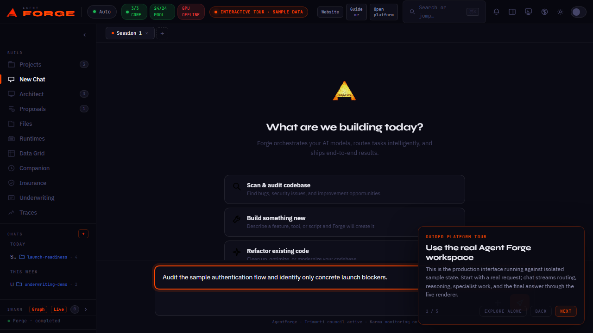
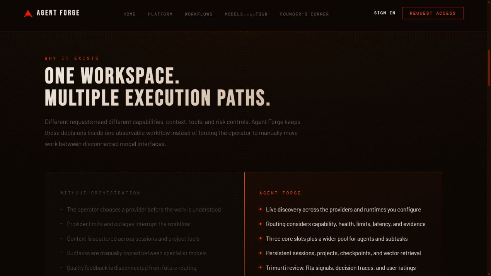

<p align="center">
  <a href="https://myagentforge.ai/">
    
  </a>
</p>

<p align="center">
  <strong>ONE AI SHOULD NOT HAVE TO DO EVERYTHING.</strong><br>
  <sub>Agent Forge coordinates control systems, specialist workers, models, tools, memory, and governed actions through one orchestration layer.</sub>
</p>

<p align="center">
  <a href="https://myagentforge.ai/"><strong>WEBSITE</strong></a>
  &nbsp;|&nbsp;
  <a href="https://myagentforge.ai/tour_factual.html#demo"><strong>PRODUCT TOUR</strong></a>
  &nbsp;|&nbsp;
  <a href="docs/EXECUTABLE_PROOF.md"><strong>EXECUTABLE PROOF</strong></a>
  &nbsp;|&nbsp;
  <a href="docs/PRODUCTION_CAPABILITIES.md"><strong>PRODUCTION CAPABILITIES</strong></a>
  &nbsp;|&nbsp;
  <a href="docs/ARCHITECTURE.md">ARCHITECTURE</a>
  &nbsp;|&nbsp;
  <a href="docs/PUBLIC_CORE.md">RUNNABLE CORE</a>
  &nbsp;|&nbsp;
  <a href="docs/QUALITY_EVIDENCE.md">QUALITY EVIDENCE</a>
</p>

---

## The idea

Thousands of models and specialist runtimes are being built for coding, reasoning, research, documents, media, vision, business workflows, and domain-specific work. Agent Forge is built around a simple premise:

**control logic, specialist-worker responsibility, and model/runtime execution should not be collapsed into one object.**

The production system therefore separates Python control and intelligence subsystems from reusable configured specialist workers and from the model/backend resources used to execute work. A configured coding worker does not permanently *be* one model. The worker responsibility can remain stable while the routing layer selects a compatible execution resource using capability, health, availability, limits, cost, latency, and bounded evidence.

Agent Forge turns that separation into a system that can classify a request, assemble persistent context, deliberate, coordinate and dispatch specialist workers, select runtimes, govern consequential actions, verify results, persist state, and use measured evidence in later decisions without treating any single model as the product.



The key boundaries are **control**, **worker responsibility**, **execution**, and **authority**. Orchestrator, Trimurti, Sentinel gates, Karma, and RTA are not presented as generic YAML workers. Reusable specialist workers form a separate configured layer. Runtime selection decides where their work executes, while governance controls what actions are allowed and verification determines whether the result can be accepted.

## What exists in production

The deployed product includes responsibilities for multi-model orchestration, reusable specialist-worker dispatch, persistent context, deliberation, runtime-state management, evidence-aware routing, tool governance, cost controls, failure handling, observability, interoperability, structured outputs, and artifact verification.

Several Agent Forge subsystems are important to the public architecture:

- **Orchestrator** — the Python control system that owns the request lifecycle and wires routing, memory, Trimurti, tools, and worker creation.
- **Trimurti** — a Python deliberation subsystem with per-request and background components, memory, sentinel integration, and pipeline responsibilities.
- **Sentinel gates** — validation/gating machinery at selected control boundaries.
- **Karma** — monitoring plus outcome/capability evidence that can inform routing and system-health decisions.
- **RTA** — a runtime-state and decision subsystem with backend lifecycle, flow/capacity, and strategy components.
- **Configured specialist workers** — reusable worker definitions instantiated and dispatched for specialist work.
- **Execution runtimes** — replaceable model/backend resources used to perform computation.

The exact production prompts, routing policy, feature construction, weights, thresholds, learned parameters, worker definitions, provider inventory, credentials, and operational configuration remain private. The public capability map explains the system at the level appropriate for external review: [Production capabilities](docs/PRODUCTION_CAPABILITIES.md).

For runnable evidence of the architectural boundary, see [Executable proof](docs/EXECUTABLE_PROOF.md). It demonstrates, with synthetic provider-neutral code, that control subsystems remain distinct from configured specialist workers and that a worker responsibility can remain stable while runtime selection changes. For a compact static trace, inspect [`examples/specialist_routing_trace.json`](examples/specialist_routing_trace.json).

## What you can inspect here

This repository is not a screenshots-only portfolio. It contains an independently authored, provider-neutral implementation of central Agent Forge control-plane patterns so reviewers can execute architectural ideas without receiving the private production engine.

| What to evaluate | Public evidence |
|---|---|
| Product thesis | Control systems, configured specialist workers, and execution runtimes are distinct layers |
| System design | Request lifecycle, deliberation, routing, tools, state, governance, and verification |
| Executable engineering | Runnable public control plane plus worker/runtime separation demo and deterministic fixtures |
| Reliability | Failure model, deadlines, fallback, circuits, terminal-state rules, and artifact checks |
| Quality | Python contract tests, repository tests, CI, CodeQL, dependency review, and release checks |
| Production depth | Sanitized capability map, codebase map, authentic product captures, and dated structural inventory |

## Start here

1. Visit [myagentforge.ai](https://myagentforge.ai/) for the product thesis and existing product surface.
2. Walk the [existing product tour](https://myagentforge.ai/tour_factual.html#demo) for the real shell with labeled sample data.
3. Read [Executable proof](docs/EXECUTABLE_PROOF.md) for the runnable control / configured-worker / runtime boundary.
4. Read [Production capabilities](docs/PRODUCTION_CAPABILITIES.md) and [Architecture](docs/ARCHITECTURE.md) for the broader verified system map.
5. Run the [provider-neutral public core](docs/PUBLIC_CORE.md), then inspect the [system walkthrough](docs/SYSTEM_WALKTHROUGH.md), [quality evidence](docs/QUALITY_EVIDENCE.md), and [failure model](docs/FAILURE_MODEL.md).

## Run the public core

The Python package under [`src/agent_forge_public`](src/agent_forge_public) is a working reference implementation of the public lifecycle. Its canonical control-plane path includes typed contracts, tenant-scoped state, bounded review, evidence routing, circuits, deadlines, budget reservation, capacity claims, compatible fallback, exact-action approval manifests, immutable artifact verification, outcome feedback, terminal stream semantics, task-state vector boundaries, protocol capability envelopes, and dependency-aware workflow scheduling.

```bash
python -m pip install -e .
python examples/worker_runtime_learning_demo.py
agent-forge-public route "Implement and verify a Python parser"
agent-forge-public demo --action write --approve "Implement and verify a Python parser"
agent-forge-public lab all
python -m unittest discover -s tests_python -v
```

It has no external package dependency, account requirement, provider credential, network call, or production configuration. The full module map is in [docs/PUBLIC_CORE.md](docs/PUBLIC_CORE.md); the production-concern-to-public-evidence rationale is in [docs/PUBLIC_IMPLEMENTATION_MAP.md](docs/PUBLIC_IMPLEMENTATION_MAP.md). A compact [sanitized event trace](examples/governed_trace.json) lets reviewers inspect a complete governed lifecycle without running the CLI.

## The existing product

The website and existing product tour are the canonical product surfaces. This repository documents those surfaces; it does not rebuild them.





<details>
  <summary><strong>Open the orchestration comparison from the website</strong></summary>
  <br>
  
</details>

## Private codebase, public evidence

Read-only inventory captured on 2026-08-15:

| Measure | Count |
|---|---:|
| Tracked files | 525 |
| Source files | 395 |
| Python modules | 343 |
| JavaScript / TypeScript modules | 41 |
| HTML / CSS surfaces | 12 |
| Test files | 136 |

Responsibility groups include:

- **Experience:** API, chat, projects, files, Data Grid, and browser product surfaces.
- **Orchestration:** pipelines, routing, configured workers, architecture work, and tool dispatch.
- **Intelligence:** Karma, Trimurti, RTA, evaluation, routing evidence, and scoring.
- **State:** database, storage, memory, vector retrieval, sessions, plans, and checkpoints.
- **Runtimes:** model clients, provider integrations, optional user runtimes, vision, and fine-tuning support.
- **Trust:** safety boundaries, permissions, approvals, sentinel validation, traces, and observability.

The detailed public map is in [docs/CODEBASE_MAP.md](docs/CODEBASE_MAP.md). This dated snapshot includes 90,937 lines of Python in the main application package and 23,411 lines across 119 Python test files. Those counts communicate scale; the map describes responsibilities rather than proprietary implementations.

## Why the production engine remains private

The value of a public showcase is to make the architecture and engineering inspectable, not to publish credentials, customer/runtime data, operational configuration, private prompts, worker definitions, or the learned policy that determines production behavior.

This repository therefore publishes architecture, responsibility maps, authentic public visuals, selected engineering decisions, deterministic reference code, tests, and repository automation while keeping the production application and its history private.

| Public here | Private by design |
|---|---|
| Architecture and responsibility maps | Production application source and Git history |
| Sanitized production capability descriptions | Prompts, policies, weights, thresholds, and learned parameters |
| Provider-neutral reference core and tests | Proprietary adapters, worker definitions, and runtime-selection implementation |
| Authentic public product captures | Authenticated application bundles and private product state |
| Repository checks and security controls | Credentials, internal configuration, private traces, and customer/session data |

The enforceable rules are documented in [docs/PUBLIC_BOUNDARY.md](docs/PUBLIC_BOUNDARY.md).

## Repository signals

[](https://github.com/Prashant10009/agent-forge-showcase/actions/workflows/ci.yml)
[](https://github.com/Prashant10009/agent-forge-showcase/actions/workflows/codeql.yml)

Every pull request runs:

```text
repository tests -> Python 3.11/3.12 tests -> compile/package smoke -> public-boundary scan -> links -> dossier -> JavaScript/Python CodeQL
```

The repository also uses dependency review, Dependabot, protected `main`, code-owner review, secret scanning, push protection, build artifacts, issue forms, pull-request templates, and tagged releases.

```bash
npm ci
npm run check
```

## Brand continuity

The public repository follows the established Agent Forge identity: dark, sharp, fire palette, alive but controlled. The triangular flame/A mark, real website imagery, product language, and **Burning Within** signature come from the existing brand system.

Browse the public SVG variants in the [official logo asset index](assets/brand/README.md), and see [brand identity notes](docs/BRAND_IDENTITY.md) for usage rules.

## Author and ownership

Agent Forge is built and architected by **Prashant Dimri**. AI systems support research, implementation, review, and testing; product direction and publication decisions remain human-owned.

Repository code and documentation are covered by [LICENSE](LICENSE). The Agent Forge name, logo, and brand identity are covered by [TRADEMARKS.md](TRADEMARKS.md); no trademark rights are granted by the software license.
