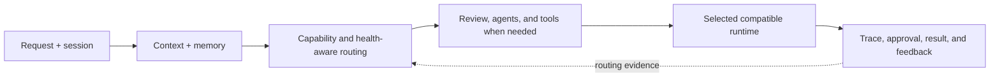

<p align="center">
  <a href="https://myagentforge.ai/">
    
  </a>
</p>

<p align="center">
  <strong>FIRE MEETS MACHINE.</strong><br>
  <sub>A private AI workspace that decides where work should run.</sub>
</p>

<p align="center">
  <a href="https://myagentforge.ai/"><strong>WEBSITE</strong></a>
  &nbsp;|&nbsp;
  <a href="https://myagentforge.ai/tour_factual.html#demo"><strong>PRODUCT TOUR</strong></a>
  &nbsp;|&nbsp;
  <a href="docs/ARCHITECTURE.md">ARCHITECTURE</a>
  &nbsp;|&nbsp;
  <a href="docs/CODEBASE_MAP.md">CODEBASE MAP</a>
  &nbsp;|&nbsp;
  <a href="docs/BRAND_IDENTITY.md">BRAND</a>
</p>

---

## The work

Agent Forge discovers configured models, routes requests using capability and live availability, coordinates agents and subtasks, stores persistent context, and records traces, reviews, approvals, and user ratings in one browser interface.

This repository is its public engineering record. It makes the product thinking, system architecture, codebase shape, security posture, and delivery discipline inspectable without publishing the private production implementation.

> **PUBLICATION BOUNDARY**
> No replica UI. No synthetic replacement product. No production source. The website and tour linked above are the existing Agent Forge product surfaces.

| What to evaluate | Evidence in this repository |
|---|---|
| Product judgment | Authentic website and tour captures, positioning, workflows, and operator controls |
| System design | Request lifecycle, package map, routing, review, tools, state, and observability |
| Engineering depth | Verified codebase inventory, architecture notes, threat model, and decision records |
| Delivery discipline | CI, CodeQL, dependency review, Dependabot, protected branches, and releases |
| Publication judgment | Explicit public/private boundary backed by automated leak scanning |

## Start here

1. Enter [myagentforge.ai](https://myagentforge.ai/).
2. Walk the [existing product tour](https://myagentforge.ai/tour_factual.html#demo).
3. Read the [architecture](docs/ARCHITECTURE.md) and [codebase map](docs/CODEBASE_MAP.md).
4. Inspect the [public-boundary gate](scripts/check-public-boundary.mjs) and [repository tests](tests/repository.test.mjs).
5. Review the Actions, security configuration, dependency updates, issues, and releases.

## How work moves



Runtime selection, execution authority, and result verification remain separate concerns. That separation is what makes the system observable, governable, and replaceable at the runtime edge.

## The existing product

The public website explains why Agent Forge exists and how work moves through it. The existing tour presents the real product shell with clearly labeled sample data. This repository documents those surfaces; it does not rebuild them.


<details>
  <summary><strong>Open the orchestration comparison from the website</strong></summary>
  <br>
  
</details>

## Private codebase, public evidence

Read-only inventory captured on 2026-08-15:

| Measure | Count |
|---|---:|
| Tracked files | 523 |
| Source files | 394 |
| Python modules | 341 |
| JavaScript / TypeScript modules | 41 |
| HTML / CSS surfaces | 12 |
| Test files | 136 |

Responsibility groups include:

- **Experience:** API, chat, projects, files, Data Grid, and browser product surfaces.
- **Orchestration:** pipelines, routing, agents, architecture work, and tool dispatch.
- **Intelligence:** Karma evidence, Trimurti review, Rta signals, evaluation, and scoring.
- **State:** database, storage, memory, vector retrieval, sessions, and checkpoints.
- **Runtimes:** model clients, provider integrations, optional user runtimes, vision, and fine-tuning support.
- **Trust:** safety boundaries, permissions, approvals, traces, and observability.

The detailed public map is in [docs/CODEBASE_MAP.md](docs/CODEBASE_MAP.md). It describes responsibilities and relationships, not proprietary implementations.

## Public/private boundary

This repository does not publish production source, Git history, prompts, routing weights, thresholds, credentials, provider inventories, operational configuration, private sessions, evaluation data, or authenticated application bundles.

It publishes system responsibilities, authentic public visuals, codebase structure, engineering decisions, and inspectable repository automation. The enforceable rules are documented in [docs/PUBLIC_BOUNDARY.md](docs/PUBLIC_BOUNDARY.md).

| Public here | Private by design |
|---|---|
| Architecture and responsibility maps | Production application source and history |
| Authentic public website captures | Authenticated application bundles |
| Curated engineering decisions | Prompts, policies, weights, and thresholds |
| Repository checks and security controls | Credentials, configuration, and runtime data |
| Clearly labeled structural counts | Customer, session, telemetry, and evaluation data |

## Repository signals

[](https://github.com/Prashant10009/agent-forge-showcase/actions/workflows/ci.yml)
[](https://github.com/Prashant10009/agent-forge-showcase/actions/workflows/codeql.yml)

Every pull request runs:

```text
repository tests -> public-boundary scan -> link validation -> dossier build -> CodeQL
```

The repository also uses dependency review, Dependabot, protected `main`, code-owner review, secret scanning, push protection, build artifacts, issue forms, pull-request templates, and tagged releases.

```bash
npm ci
npm run check
```

Repository metadata and documentation point to the existing website and tour. GitHub Pages is intentionally disabled so this repository cannot become a competing product surface.

## Brand continuity

The public repository follows the established Agent Forge identity: dark, sharp, fire palette, alive but controlled. The triangular flame/A mark, real website imagery, product language, and **Burning Within** signature come from the existing brand system.

The complete public SVG export set includes the primary stacked and horizontal lockups, four icon sizes, static, thinking, topbar, watermark, and monochrome variants. Browse or download every variant from the [official logo asset index](assets/brand/README.md), and see the curated [brand identity notes](docs/BRAND_IDENTITY.md) for usage rules.

## Author and ownership

Agent Forge is built and architected by **Prashant Dimri**. AI systems support research, implementation, review, and testing; product direction and publication decisions remain human-owned.

Repository code and documentation are covered by [LICENSE](LICENSE). The Agent Forge name, logo, and brand identity are covered by [TRADEMARKS.md](TRADEMARKS.md); no trademark rights are granted by the software license.
