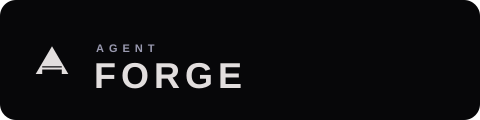
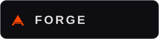
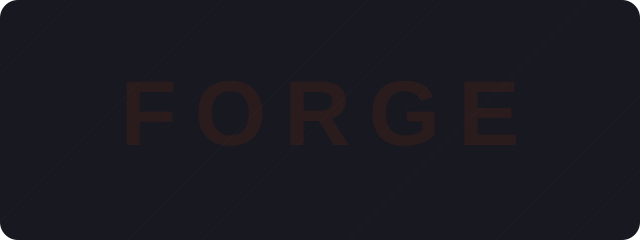

# Agent Forge logo assets

These SVGs are public exports of the established Agent Forge logo system. The triangular mark is both an **A** for Agent and a flame in motion; its crossbar is the workbench. Animated variants rotate on a three-second linear cycle and move through the documented fire palette. Reduced-motion preferences fall back to static brand fire.

Do not substitute unrelated marks, redraw the path, or use brand fire as an operational error/status color.

## Lockups

| Variant | Preview | Intended use |
|---|---|---|
| [Primary stacked](agent-forge-primary-stacked.svg) |  | Documentation headers, hero placement, splash screens |
| [Horizontal dark](agent-forge-horizontal-dark.svg) |  | Dark navigation, sidebars, product headers |
| [Horizontal light](agent-forge-horizontal-light.svg) |  | Print, light interfaces, external documents |
| [Static lockup](agent-forge-static-lockup.svg) |  | Email, PDF, print, or environments without animation |
| [Monochrome](agent-forge-monochrome.svg) |  | Single-color reproduction and image overlays |

## Product-state variants

| Variant | Preview | Intended use |
|---|---|---|
| [Thinking state](agent-forge-thinking.svg) |  | AI processing indicator |
| [Topbar lockup](agent-forge-topbar.svg) |  | Application topbar identity |
| [Watermark](agent-forge-watermark.svg) |  | Empty states and content-panel backgrounds |

## Icon sizes

| 16 px | 24 px | 36 px | 52 px |
|---|---|---|---|
| [Download](agent-forge-mark-16.svg)  | [Download](agent-forge-mark-24.svg)  | [Download](agent-forge-mark-36.svg)  | [Download](agent-forge-mark-52.svg)  |

## Source specification

- Mark viewBox: `0 0 88 76`
- Static brand fire: `#ff4500`
- Animated fire cycle: `#ff2200` to `#ff6600` to `#ff4500` to `#cc1100`
- Spin: `3s linear infinite`
- Color cycle: `2.4s ease-in-out infinite alternate`
- Minimum clear space: one mark width on every side
