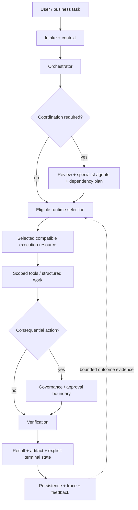

# Architecture

Agent Forge is a multi-model orchestration system built around a strict separation between **role**, **execution**, **authority**, and **evidence**.

- An **agent** owns a responsibility.
- A **runtime/model** is an execution resource selected for a task.
- **Governance** determines what that execution resource may do.
- **Verification and outcome evidence** determine what the system should accept and what later routing decisions may learn from.

That separation lets the system replace or re-rank execution resources without redefining every agent whenever the model landscape changes.

This document describes public system responsibilities. It does not reproduce private production implementation, prompts, provider configuration, routing policy, learned parameters, or operational data.

A working implementation of the public lifecycle is available in [PUBLIC_CORE.md](PUBLIC_CORE.md). The broader production responsibility map is documented in [PRODUCTION_CAPABILITIES.md](PRODUCTION_CAPABILITIES.md).

## System shape

Not every request invokes every subsystem. Straightforward work can take a short path. Complex, multi-step, or consequential work can add decomposition, review, multiple specialist agents, tools, approvals, artifact checks, and richer state handling.

## Responsibility layers

### 1. Experience and intake

The product surface connects chat, projects, files, agents, traces, approvals, settings, and structured work. Intake establishes the user/task context before routing or tools are considered.

### 2. Context and state

Sessions, project state, checkpoints, retrieval, memory, approvals, traces, ratings, and artifacts have different lifecycles. The orchestration layer can assemble the context needed for the current task without making one model call responsible for long-term system state.

### 3. Orchestration

The orchestrator owns the request lifecycle. It decides whether the task can be handled directly or needs coordination, decomposition, review, specialist agents, tools, or approval boundaries.

The orchestrator is not itself synonymous with the model that eventually performs inference.

### 4. Agents

Agents represent responsibilities and bounded operating roles. A specialist agent may own coding, research, analysis, document work, media work, or another workflow responsibility while remaining independent of any single model vendor or model version.

This distinction is central to Agent Forge: **models do not have organizational roles; agents do.**

### 5. Intelligence and runtime selection

Routing first narrows execution to compatible candidates and then considers bounded signals such as capability, health, limits, latency, availability, cost, and accumulated outcome evidence.

Public architectural concepts include:

- **Karma** — outcome evidence that can influence later execution decisions.
- **Trimurti** — bounded multi-perspective review for selected significant work.
- **RTA signals** — additional execution-slot context used independently from the agent role.

The exact production policy — including inventories, prompts, feature construction, weights, thresholds, learned parameters, and fallback policy — remains private.

### 6. Runtime and tools

Provider adapters, compatible runtimes, agent tools, data connections, and protocol bridges sit behind controlled interfaces. Compatibility and health are checked before dispatch.

Selecting a runtime only answers **where computation should run**. It does not grant permission to mutate files, call external systems, spend arbitrary resources, or perform consequential actions.

### 7. Governance and authority

Model confidence and execution authority are separate concerns. Consequential actions can be captured, scoped, reviewed, approved, rejected, expired, or cancelled independently from the runtime that proposed them.

The public reference core demonstrates exact-action approval manifests and bounded authority without reproducing production governance policy.

### 8. Verification and terminal state

A generated answer is not automatically success. Structured outputs, artifacts, state transitions, and tool results can be validated before the system records completion.

Terminal states are explicit: success, failure, rejection, expiry, or cancellation are distinct outcomes. Silence or a dropped stream is not treated as successful completion.

### 9. Evidence and observability

Traces, evaluations, ratings, health signals, and structured outcomes provide evidence about what happened. That evidence can support debugging and later routing decisions, but it is treated as bounded evidence rather than infallible truth.

## Why this architecture matters

The model ecosystem changes faster than most application architectures. A system tightly coupled to one model forces product behavior to change whenever that model changes.

Agent Forge instead keeps several concerns independent:

| Concern | Question |
|---|---|
| Agent role | Who owns this responsibility? |
| Routing | Which compatible execution resource should handle this task now? |
| Governance | What is that execution path allowed to do? |
| Verification | Did it actually produce an acceptable result? |
| Evidence | What should the system remember about the outcome? |

That makes model choice replaceable while the surrounding organizational workflow remains stable.

## Production principles

- Treat edge health, application health, runtime health, and task success as different signals.
- Keep terminal states explicit; silence is not success.
- Bound provider operations with deadlines, cancellation, and compatible fallback.
- Separate model confidence from permission to act.
- Keep agent responsibilities independent from specific runtime identities.
- Store traces and feedback as evidence, not as unquestioned truth.
- Preserve user/project authorization across retrieval and tool boundaries.
- Bind consequential approvals to captured actions and ownership scope.
- Verify structured state and artifacts rather than accepting free-form output alone when stronger checks are available.
- Keep credentials and private operational configuration outside the public repository.

## Public limit

The architecture is intentionally precise about responsibilities and intentionally silent about proprietary or exploitable production details.

Continue with [PRODUCTION_CAPABILITIES.md](PRODUCTION_CAPABILITIES.md), [PUBLIC_IMPLEMENTATION_MAP.md](PUBLIC_IMPLEMENTATION_MAP.md), [FAILURE_MODEL.md](FAILURE_MODEL.md), [PUBLIC_BOUNDARY.md](PUBLIC_BOUNDARY.md), and [THREAT_MODEL.md](THREAT_MODEL.md).
