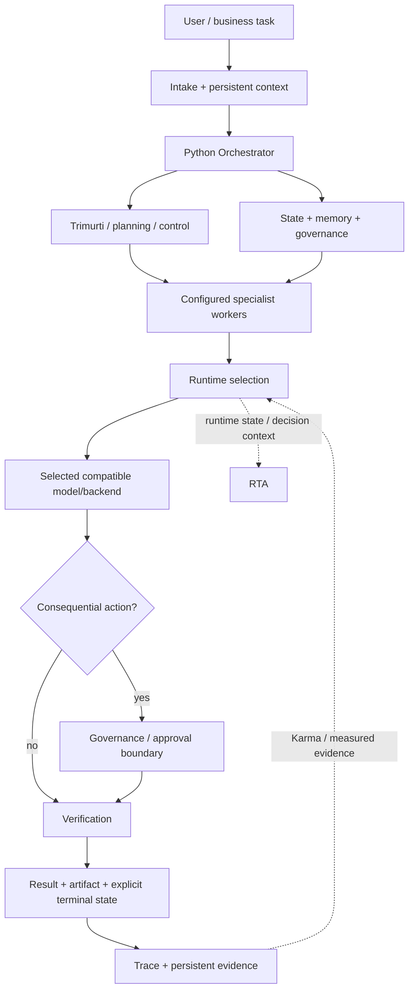

# Architecture

Agent Forge is a multi-model orchestration system that separates **control systems**, **configured specialist workers**, **execution runtimes**, **authority**, and **evidence**.

- **Control and intelligence subsystems** coordinate the request lifecycle, deliberation, validation, routing intelligence, runtime state, memory, and governance.
- **Configured specialist workers** represent reusable responsibilities that can be instantiated and dispatched for specialist work.
- A **runtime/model backend** is a replaceable execution resource selected for a task.
- **Governance** determines what an execution path may do.
- **Verification and evidence** determine what the system should accept and what later decisions may learn from.

This distinction matters because Agent Forge is not one universal `Agent` abstraction with different model names underneath it. The production control plane contains distinct Python subsystems, while configured workers and execution runtimes occupy separate layers.

This document describes public system responsibilities. It does not reproduce private production implementation, prompts, worker definitions, provider configuration, routing policy, learned parameters, or operational data.

A working implementation of the public lifecycle is available in [PUBLIC_CORE.md](PUBLIC_CORE.md). A runnable proof of the worker/runtime boundary is in [EXECUTABLE_PROOF.md](EXECUTABLE_PROOF.md). The broader production responsibility map is documented in [PRODUCTION_CAPABILITIES.md](PRODUCTION_CAPABILITIES.md).

## System shape

Not every request invokes every subsystem. Straightforward work can take a short path. Complex, multi-step, or consequential work can add deliberation, decomposition, multiple specialist workers, tools, approvals, artifact checks, and richer state handling.

## Responsibility layers

### 1. Experience and intake

The product surface connects chat, projects, files, configured workers, traces, approvals, settings, and structured work. Intake establishes user and task context before routing or tools are considered.

### 2. Context and state

Sessions, project state, persistent plans, checkpoints, retrieval, memory, approvals, traces, ratings, and artifacts have different lifecycles. The orchestration layer can assemble the context needed for current work without making one model call responsible for long-term system state.

### 3. Orchestrator

The Orchestrator is a Python control system that owns the request lifecycle and wires routing, memory, Trimurti, tools, and worker creation/dispatch. It is not synonymous with the model that eventually performs inference and is not merely another configured specialist worker.

### 4. Trimurti and sentinel validation

Trimurti is a Python deliberation subsystem with per-request and background responsibilities, memory, sentinel integration, and pipeline components. It should not be reduced to a generic worker or a single review prompt.

Sentinel gates provide validation/gating at selected control boundaries. They are control-plane validation machinery rather than configured specialist workers.

### 5. Configured specialist workers

Production contains a reusable configured-worker layer. These workers carry specialist responsibilities and can be instantiated and dispatched for work without permanently binding the responsibility to one model/backend identity.

The public executable proof uses synthetic worker definitions to demonstrate this separation without publishing the private worker inventory or definitions.

### 6. Karma, RTA, and runtime selection

Runtime selection narrows execution to compatible candidates and can consider bounded operating information such as capability, health, limits, latency, availability, cost, and measured evidence.

Two production subsystems are broader than simple routing labels:

- **Karma** — monitoring plus outcome/capability evidence that can inform routing and system-health decisions.
- **RTA** — a runtime-state and decision subsystem with backend lifecycle, flow/capacity, and strategy responsibilities.

Neither is represented publicly as a generic worker. The exact production policy — including inventories, prompts, feature construction, weights, thresholds, learned parameters, and fallback policy — remains private.

### 7. Runtime and tools

Provider adapters, compatible model/backend runtimes, tools, data connections, and protocol bridges sit behind controlled interfaces. Compatibility and health can be checked before dispatch.

Selecting a runtime answers **where computation should run**. It does not itself grant permission to mutate files, call external systems, spend arbitrary resources, or perform consequential actions.

### 8. Governance and authority

Model confidence and execution authority are separate concerns. Consequential actions can be captured, scoped, reviewed, approved, rejected, expired, or cancelled independently from the runtime that proposed them.

The public reference core demonstrates exact-action approval manifests and bounded authority without reproducing production governance policy.

### 9. Verification and terminal state

A generated answer is not automatically success. Structured outputs, artifacts, state transitions, and tool results can be validated before the system records completion.

Terminal controls and machine terminal states distinguish completion, failure, rejection, expiry, or cancellation. Silence or a dropped stream is not treated as successful completion.

### 10. Evidence and observability

Traces, evaluations, ratings, health signals, and structured outcomes provide evidence about what happened. Evidence can support debugging, system health, and later routing decisions without being treated as infallible truth.

## Why this architecture matters

The model ecosystem changes faster than most application architectures. Agent Forge keeps several concerns independently evolvable:

| Concern | Question |
|---|---|
| Control plane | What lifecycle, deliberation, state, and validation should govern the request? |
| Specialist worker | What reusable responsibility should perform this part of the work? |
| Routing | Which compatible execution resource should handle it now? |
| Governance | What is that execution path allowed to do? |
| Verification | Did it actually produce an acceptable result? |
| Evidence | What measured information should later decisions be allowed to use? |

That makes model choice replaceable without flattening the surrounding control plane or specialist-worker structure into the model itself.

## Production principles

- Treat edge health, application health, runtime health, and task success as different signals.
- Keep terminal states explicit; silence is not success.
- Bound provider operations with deadlines, cancellation, and compatible fallback.
- Separate model confidence from permission to act.
- Keep configured worker responsibilities independent from specific runtime identities.
- Keep control/intelligence subsystems distinct from the configured-worker layer.
- Store traces and feedback as evidence, not as unquestioned truth.
- Preserve user/project authorization across retrieval and tool boundaries.
- Bind consequential approvals to captured actions and ownership scope.
- Verify structured state and artifacts rather than accepting free-form output alone when stronger checks are available.
- Keep credentials and private operational configuration outside the public repository.

## Public limit

The architecture is intentionally precise about responsibilities and intentionally silent about proprietary or exploitable production details.

Continue with [EXECUTABLE_PROOF.md](EXECUTABLE_PROOF.md), [PRODUCTION_CAPABILITIES.md](PRODUCTION_CAPABILITIES.md), [PUBLIC_IMPLEMENTATION_MAP.md](PUBLIC_IMPLEMENTATION_MAP.md), [FAILURE_MODEL.md](FAILURE_MODEL.md), [PUBLIC_BOUNDARY.md](PUBLIC_BOUNDARY.md), and [THREAT_MODEL.md](THREAT_MODEL.md).
