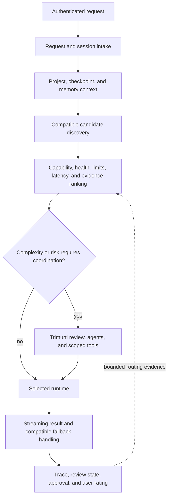

# Architecture

Agent Forge is a private AI workspace that decides where work should run, coordinates the work, preserves context, and records enough evidence for an operator to understand what happened.

This document describes system responsibilities already presented by the public website. It does not reproduce private implementation, prompts, provider configuration, or routing policy.

## Request lifecycle

Not every request invokes every subsystem. Straightforward work can take a shorter path; complex or consequential work can add review, agent decomposition, tools, and approval boundaries.

## Responsibility layers

### Experience

The browser product connects chat, projects, files, runtimes, Data Grid, traces, agents, approvals, and settings. The interface distinguishes proposed, running, blocked, failed, and completed work.

### Orchestration

The orchestration layer converts a request into staged work. It assembles context, evaluates compatible execution paths, coordinates subtasks, scopes tools, handles fallbacks, and returns structured state to the interface.

### Intelligence and review

Routing combines declared capability with live availability and accumulated evidence. Karma represents outcome evidence; Trimurti adds multi-perspective review for selected work; Rta signals contribute additional system context. These concepts are public, while their private weights, prompts, and thresholds are not.

### State and retrieval

Sessions, projects, checkpoints, approvals, traces, ratings, and routing evidence have different lifecycles. Durable storage and vector retrieval are optional dependencies with explicit health and authorization boundaries.

### Runtime and tools

Provider adapters, optional compatible runtimes, agent tools, and data connections sit behind controlled interfaces. Compatibility and health are checked before dispatch; runtime selection never grants action authority by itself.

## Production principles

- Treat edge health, application health, provider health, and task success as different signals.
- Keep terminal states explicit; silence is not success.
- Bound provider operations with timeouts, cancellation, and compatible fallbacks.
- Separate model confidence from permission to act.
- Store traces and feedback as evidence, not as infallible truth.
- Keep secrets and provider credentials server-side.
- Preserve project and user authorization across every retrieval and tool boundary.

## Public limit

The architecture is intentionally precise about responsibilities and intentionally silent about exploitable or proprietary implementation details. See [PUBLIC_BOUNDARY.md](PUBLIC_BOUNDARY.md) and [THREAT_MODEL.md](THREAT_MODEL.md).
