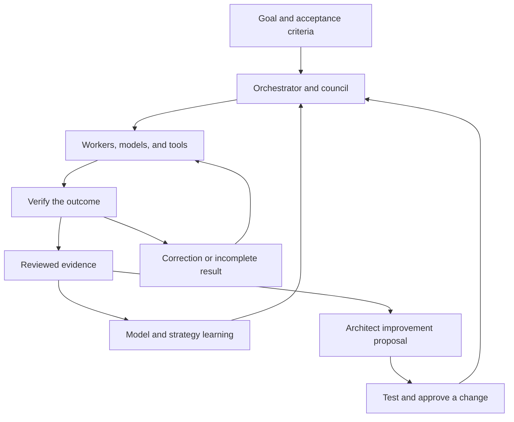

# Build your own orchestration system

Agent Forge makes the relationships between planning, execution, evaluation, and learning inspectable. You can reuse the public patterns to build a system around your own tasks, models, and review criteria. The names are optional; the responsibilities matter.

This is a design guide connected to the runnable public core. The reference examples are independently authored, synthetic, and offline. They are not exports of the production implementation.

## Map the concepts

| Familiar concept | Agent Forge component | Responsibility | Public starting point |
|---|---|---|---|
| Workflow coordinator | Orchestrator | Own the goal, plan, current step, and terminal outcome | [PublicControlPlane](../src/agent_forge_public/control_plane.py) |
| Multi-perspective review | Council / Trimurti | Propose an approach, preserve constraints, challenge scope and completion | [ReviewCouncil](../src/agent_forge_public/review.py) |
| Outcome-based model selection | Karma | Collect comparable evidence about model performance and apply bounded learning | [OutcomeLedger](../src/agent_forge_public/control.py), [EvidenceRouter](../src/agent_forge_public/selection.py) |
| System improvement | Architect | Investigate recurring weaknesses and propose changes with acceptance criteria | Design recipe below; no public production-equivalent Architect |
| Runtime and strategy management | RTA | Account for health, capacity, lifecycle, and the shape of execution | [Control primitives](../src/agent_forge_public/control.py); wider strategy learning is a documented production concept |
| Specialist role | Worker | Define a responsibility independently of the model that executes it | [Worker templates](../src/agent_forge_public/worker_templates.py) |
| Execution resource | Runtime | Supply a compatible model or tool backend | [Adapters](../src/agent_forge_public/adapters.py) |
| Memory | State and retrieval | Carry relevant task context across steps and sessions | [State](../src/agent_forge_public/state.py), [task-state contracts](../src/agent_forge_public/task_state.py) |
| Action authorization | Governance | Decide what an execution path is allowed to do | [Exact-action manifests](../src/agent_forge_public/manifests.py) |
| Acceptance testing | Verification | Check the actual deliverable against the request | [Execution](../src/agent_forge_public/execution.py), [quality evidence](QUALITY_EVIDENCE.md) |

## Keep the feedback loop explicit



The council reviews the work, Karma learns from evidence, and the Architect proposes changes to the system. A model recommendation does not grant permission to perform an action.

## 1. Give the orchestrator a small, explicit contract

Start with a goal, deliverables, acceptance criteria, task identity, resource limits, and current plan state. Separate the intended plan from the actions that actually ran. A resumed task should know which outputs exist and which steps remain open.

Build one complete path before adding more roles: request → select → execute → verify → record → finish. Then add branching, specialist work, and recovery. The public core demonstrates cancellation, capacity contention, fallback, and explicit terminal outcomes.

## 2. Make a council useful rather than ceremonial

Give each reviewer a distinct question. For example: what approach can achieve the goal; which constraints must survive; what should be cut, challenged, or verified? Ask for findings tied to evidence and specific plan changes.

In Agent Forge, Bodha, Dharma, and Tapas represent creation, preservation, and challenge. The current planning flow is ordered. Your own design can use other perspectives, but duplicating the same prompt across three models does not establish independent verification.

The public `ReviewCouncil` uses deterministic rules to demonstrate the contract. Connecting real model reviewers, measuring their independence, and handling disagreement are work for your implementation.

## 3. Build your own Karma from a clear outcome record

Begin with the task family, actual runtime, result, verification evidence, latency, and measured resource use. Decide which records are comparable before deciding how to score them.

A practical first policy can distinguish:

- verified completion;
- a verified model error;
- a provider or capacity failure;
- an unresolved outcome;
- a run corrected by a human.

Keep all five for audit, but do not teach model quality from all five in the same way. A rate limit is not proof of poor reasoning. A nonempty response is not proof that a file was created.

Run the new [evaluation-to-learning example](../examples/evaluation_learning_loop.py). It demonstrates the acceptance boundary before evidence reaches `OutcomeLedger`. Then run the existing [worker/runtime example](../examples/worker_runtime_learning_demo.py) to see a stable worker responsibility route to a different runtime after synthetic outcome evidence changes.

## 4. Give the Architect a proposal loop

An Architect should be able to inspect a recurring problem and produce a reviewable change proposal:

| Proposal field | What it answers |
|---|---|
| Observed problem | Which repeated failure or limitation matters? |
| Evidence | Which outcomes, tests, or artifacts support that conclusion? |
| Hypothesis | What change is expected to help, and why? |
| Scope | What is allowed to change? |
| Acceptance criteria | What would show improvement or regression? |
| Rollback | How can the change be reversed? |
| Authority | Who may approve and apply it? |

Evaluate the proposal before implementation, then evaluate the implementation against the same criteria. Keep system improvement separate from the current user task so a repair does not silently redefine the goal. This is a reusable design recipe; this repository does not claim to include the production Architect.

## 5. Make learning an evaluated change

Use memory for relevant past context, outcome statistics for routing evidence, and a training pipeline for learned components. These are different mechanisms. Adaptation in the control system does not fine-tune an external model automatically.

Keep a held-out set, group related conversations when splitting data, record assistance, and compare the candidate against a baseline. Shadow evaluation lets you record a candidate's decisions while the existing policy remains in charge. Choose an activation rule appropriate to your own task rather than inheriting somebody else's production thresholds.

## Run the public examples

From the repository root:

```bash
python -m pip install -e .
python examples/evaluation_learning_loop.py
python examples/worker_runtime_learning_demo.py
agent-forge-public lab all
```

The first example emits a synthetic evidence ledger with acceptance reasons. The second reports `worker_unchanged: true` and `runtime_changed: true`. The lab exercises the existing control plane. These show inspectable mechanisms, not a claim that synthetic results establish real-model performance.

Continue with the [evaluation framework](EVALUATION_FRAMEWORK.md), [learning systems](LEARNING_SYSTEMS.md), [historical leaderboard](LEADERBOARD.md), and [development update](DEVELOPMENT_UPDATE.md).

## Choose a small decision to learn first

Start with a question whose outcome you can inspect: whether a message continues a task, whether a deliverable exists, or which capability a plan step requires. Keep the inputs, proposed label, source episode, review, and result connected. Measure false positives and false negatives against your current approach. The [behavior guide](BEHAVIOR_EVALUATION.md) shows why an accuracy gain can hide a recall loss; the [system guide](HOW_AGENT_FORGE_WORKS.md) connects the concepts to real responsibilities.
