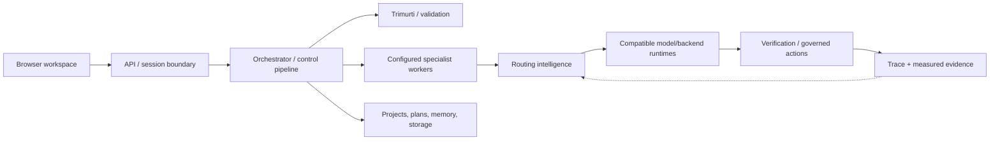

# Private Codebase Map

This map gives reviewers a concrete view of the production system without copying private source. Names describe stable responsibility areas observed read-only in the private repository.

## Verified snapshot

Snapshot date: 2026-08-15.

| Measure | Count |
|---|---:|
| Tracked files | 525 |
| Source files | 395 |
| Python modules | 343 |
| JavaScript files | 23 |
| TypeScript files | 17 |
| HTML files | 9 |
| CSS files | 3 |
| Test files | 136 |
| Python lines in the main application package | 90,937 |
| Python test files | 119 |
| Python test lines | 23,411 |
| Python test functions | 867 |

Counts are a point-in-time inventory, not a claim that every file has equal product significance.

## Responsibility map

| Area | Representative private packages | Responsibility |
|---|---|---|
| Product experience | `api`, `chat`, `projects`, `data_grid` | Browser surfaces, request handling, sessions, files, and structured-data workflows |
| Control and orchestration | `brain`, `pipeline`, `architect`, `tools` | Request lifecycle, planning, coordination, delegation, proposals, and controlled tool execution |
| Configured workers | `agents` plus configuration | Reusable specialist-worker definitions, creation, dispatch, and running-worker state |
| Routing intelligence | `routing`, `karma`, `rta`, `neural_scorer`, `eval` | Candidate selection, monitoring/evidence, runtime-state decisions, scoring support, and evaluation |
| Deliberation and validation | `trimurti` and sentinel components | Per-request/background deliberation and validation/gating responsibilities |
| State | `db`, `storage`, `memory`, `vector` | Durable records, retrieval, plans/checkpoints, and semantic context |
| Runtime access | `model_client`, `integrations`, `vision`, `finetune` | Provider/runtime abstraction, multimodal work, optional runtimes, and model-development support |
| Trust and observability | `safety`, `observability` plus governance surfaces | Permission boundaries, approvals, traces, diagnostics, and operational evidence |

These package names are included only as a coarse responsibility inventory. They are not an API map or a guide to private implementation.

## How the pieces meet

## What reviewers can infer

- The product is not a thin provider wrapper; control, routing intelligence, configured workers, deliberation, persistence, governance, and observability are distinct concerns.
- The control plane is not simply a collection of identical generic agents.
- Reusable configured workers and replaceable execution runtimes occupy separate layers.
- The browser experience is backed by explicit session/project state rather than a single stateless prompt box.
- Quality evidence and human authority are different system concerns.
- Optional runtimes and providers are adapters, not the product boundary.
- Testing is substantial enough to cover units and cross-component behavior, while public CI separately protects publication safety.

## What this map withholds

No private file contents, prompts, worker definitions, credentials, endpoint inventories, routing coefficients, thresholds, database schemas, operational commands, customer data, or private Git history are included.

Reviewers who want executable evidence can inspect [EXECUTABLE_PROOF.md](EXECUTABLE_PROOF.md), the independently authored [runnable public core](PUBLIC_CORE.md), and its [implementation map](PUBLIC_IMPLEMENTATION_MAP.md). Those public artifacts preserve selected responsibility boundaries while replacing private integrations and policy with neutral, deterministic examples.
