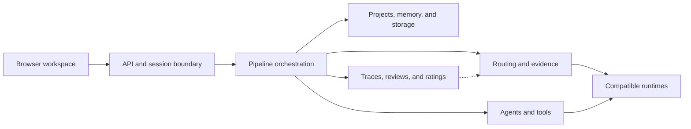

# Private Codebase Map

This map gives reviewers a concrete view of the production system without copying private source. Names describe stable responsibility areas observed read-only in the private repository.

## Verified snapshot

Snapshot date: 2026-08-15.

| Measure | Count |
|---|---:|
| Tracked files | 523 |
| Source files | 394 |
| Python modules | 341 |
| JavaScript files | 23 |
| TypeScript files | 17 |
| HTML files | 9 |
| CSS files | 3 |
| Test files | 136 |

Counts are a point-in-time inventory, not a claim that every file has equal product significance.

## Responsibility map

| Area | Representative private packages | Responsibility |
|---|---|---|
| Product experience | `api`, `chat`, `projects`, `data_grid` | Browser surfaces, request handling, sessions, files, and structured-data workflows |
| Orchestration | `pipeline`, `routing`, `agents`, `architect`, `tools` | Stage coordination, candidate selection, delegation, proposals, and controlled tool execution |
| Intelligence | `karma`, `trimurti`, `rta`, `neural_scorer`, `eval` | Outcome evidence, review, system signals, scoring support, and evaluation |
| State | `db`, `storage`, `memory`, `vector` | Durable records, retrieval, checkpoints, and semantic context |
| Runtime access | `model_client`, `integrations`, `vision`, `finetune` | Provider abstraction, optional runtimes, multimodal work, and model-development support |
| Trust | `safety`, `observability` | Permission boundaries, approvals, traces, diagnostics, and operational evidence |

## How the pieces meet

## What reviewers can infer

- The product is not a thin provider wrapper; routing, review, persistence, tooling, and observability are first-class subsystems.
- The browser experience is backed by explicit session and project state rather than a single stateless prompt box.
- Quality evidence and human authority are different system concerns.
- Optional runtimes and providers are adapters, not the product boundary.
- Testing is substantial enough to cover units and cross-component behavior, while public CI separately protects publication safety.

## What this map withholds

No file contents, prompts, credentials, endpoint inventories, routing coefficients, thresholds, database schemas, operational commands, customer data, or private Git history are included.
