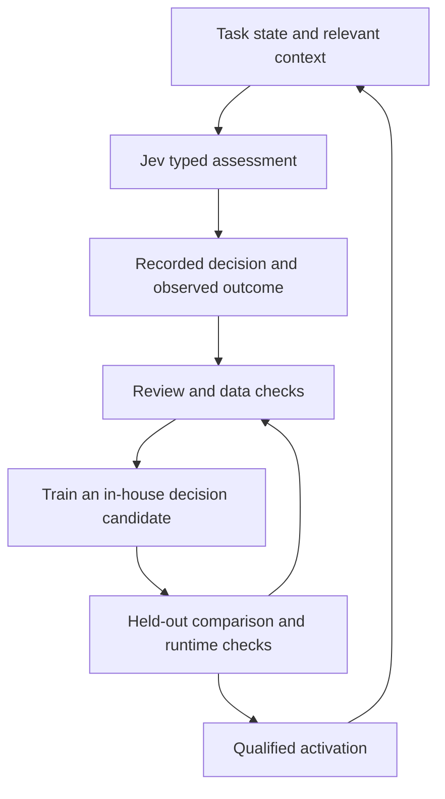

# Jev, ModernBERT, ModernColBERT, and BGE retirement

Agent Forge's direction is to retain more of its operational knowledge in its own trained components while keeping execution models replaceable. That involves two connected jobs: **retrieve the relevant context** and **answer a specific decision question about the work**.

The roles below describe committed code and configuration reviewed October 5, 2026, alongside explicitly identified research and planned work. They are not a live service-health report.

## Production target: October 6, 2026

The planned transition connects Jev across Agent Forge's Python automations, trained ModernBERT decisions and retrieval, ModernColBERT reranking, and retirement of the remaining BGE-M3 dependencies. The founder has set **October 6** as the production-completion target. This is the immediate engineering direction, rather than an open-ended research backlog.

The latest handoff revisions describe the division of responsibility: the Orchestrator, Karma, RTA, Architect, council, and sentinels retain their roles; Jev supplies typed assessments where those systems need judgment; in-house heads take over decisions as they qualify; retrieval carries relevant experience into the next decision. The October 5 state below records the starting point for this rollout. Completion will be reflected after production verification.

| Component | Job in Agent Forge | Current state |
|---|---|---|
| Jev | Answer typed questions from task state and supplied context | Enabled for selected turn-start decisions; shared question access supports subsystems, tools, and logged-only observation |
| Fine-tuned GTE-ModernBERT | Encode task text and stored material for retrieval | Round 3 selected for builder logs, Architect memory, task-state retrieval, and insurance knowledge; round 2 selected for the main nearest-neighbor turn classifiers |
| ModernBERT decision heads | Learn specific operational decisions from reviewed examples | Trivial-message and council candidates trained and measured, but disabled |
| GTE-ModernColBERT | Reorder retrieved candidates using finer-grained query/document matching | Locally benchmarked and planned; not configured as an active production reranker in the reviewed code |
| BGE-M3 | Existing embeddings and similarity-dependent behavior | Still used on remaining paths and for primary vector writes; retirement is incomplete |
| ONNX Runtime | Execute exported in-house models on CPU | Used by the Forge retrieval encoder; decision candidates have also undergone runtime-parity checks |

## Jev supplies decisions through a shared contract

Instead of asking for an unrestricted essay, a caller supplies state and a typed question: choose an option, assess a condition, or return a score. The service validates the response before returning it. The current turn-start path uses Jev for selected task-type, strategy, and retrieval decisions, with existing behavior available when an answer cannot be obtained.

The same question interface gives the Orchestrator, Karma, RTA, Architect, council, and sentinels a way to request an assessment. Most registered subsystem callers are configured to log answers rather than act on them. Availability of that interface does not mean every automation already delegates its decisions to Jev.

In this integration, Agent Forge context is supplied to hosted Jev per request. The in-house training work is on Agent Forge's own encoders and decision heads. Logged Jev answers can become candidate labels, but review, provenance, and outcome checks determine how they should be used.

## ModernBERT retrieval and ModernBERT decisions are different

The fine-tuned **GTE-ModernBERT retrieval encoder** helps find relevant material: earlier build decisions, proposals, task experience, or domain passages. It was trained for retrieval on selected Agent Forge material. Its deployment is already useful even while learned decision heads remain inactive.

A **decision head** answers a narrower operational question, such as whether a short message is a continuation or whether a task needs a council. A good retrieval encoder does not automatically make that decision well. The [behavior evaluation](BEHAVIOR_EVALUATION.md) reports the separately trained candidates and their error tradeoffs.

There is also an intermediate mechanism: the main turn classifiers use the Forge encoder to compare an input with labelled reference examples. That nearest-neighbor classification is distinct from enabling the learned decision heads. This is why “ModernBERT is in use” and “the decision heads are disabled” can both be true.

## ModernColBERT adds a second retrieval pass

Dense retrieval finds a shortlist of relevant material. The proposed GTE-ModernColBERT stage then examines finer-grained matches within that shortlist to reorder it before context is supplied downstream.

The saved local benchmark tested that combination and found a promising retrieval result on its tested corpus, with additional processing time. Production adoption still requires appropriate held-out queries, serving-path measurements, and integration. The reviewed code's older BGE ColBERT helper does not establish that GTE-ModernColBERT is deployed.

The intended retrieval sequence is **request → dense shortlist → evaluated reranking → selected context**. The last two stages should preserve provenance so a model can use the source of a retrieved claim.

## BGE-M3 retires one dependency at a time

The new encoder produces a different vector space. Existing stored vectors, query vectors, indexes, and similarity cutoffs must agree. Even two encoder versions with the same vector length can produce incompatible spaces.

The implemented migration supports separate vector fields, writing old and new representations alongside each other, rebuilding older records from stored text, version checks, and individually configured read paths. Switching a read does not by itself remove the old write path or loader.

| Area | Selected path in the reviewed configuration |
|---|---|
| Builder logs, Architect memory, task states, insurance knowledge | Forge encoder round 3, with guarded fallback behavior |
| Main nearest-neighbor turn classifiers | Forge encoder round 2 |
| Council deliberation memory | BGE-M3 reads; new-space preparation exists |
| Feedback-rule and visual-router classification; auto-agent similarity | BGE-M3 |
| Task-signature cache, council fast cache, learned-rule deduplication | BGE-M3 |
| Primary vector writes | BGE-M3 space, alongside configured Forge-space writes |

The remaining work is to validate each replacement on its own task, migrate the remaining reads and writes, resolve fallback dependencies, and then remove BGE's loading and packaging. A successful retrieval test alone cannot establish that every dependent classifier or cache is ready to move.

## How the learning loop connects

This is the development direction, with different stages already implemented or measured. Today, the service selects a backend that can answer all questions in a request. Merely enabling a head would not make it handle an unsupported question bundle; broader per-question takeover still needs integration and evaluation.

See [how Agent Forge works](HOW_AGENT_FORGE_WORKS.md), the [learning map](LEARNING_SYSTEMS.md), and the [development update](DEVELOPMENT_UPDATE.md) for the wider system and proposed next steps. These explanations expose the component roles and migration method while keeping raw training data, private prompts, learned weights, and operational policy private.
