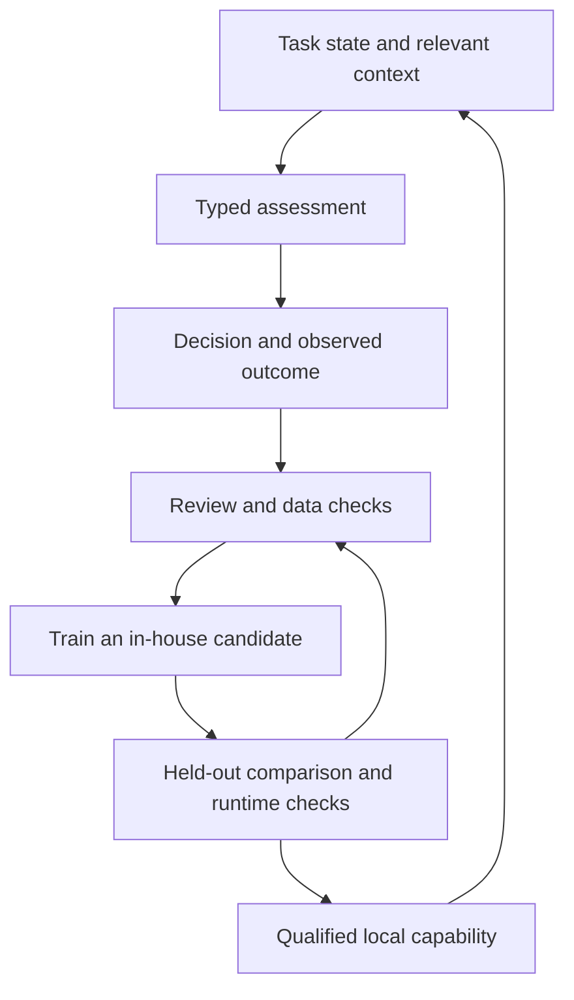

# The decision and retrieval stack

Agent Forge combines Jev, its own trained ModernBERT components, and ModernColBERT retrieval refinement in one workflow engine. Python systems coordinate the work, models supply specialized judgment and execution, and reviewed experience improves the platform's own components.

## Each component has a distinct job

| Component | Responsibility | Value to the workflow |
|---|---|---|
| Jev | Answer typed questions from task state and relevant context | Give automations a shared way to choose, check, and score |
| Fine-tuned GTE-ModernBERT | Encode requests and stored material for retrieval | Find relevant build decisions, task experience, proposals, and domain knowledge |
| ModernBERT decision heads | Answer qualified operational questions learned from reviewed examples | Keep learned platform behavior close to the execution engine |
| GTE-ModernColBERT | Rerank the dense retrieval shortlist through finer-grained query/document matching | Select more useful context from the initial candidates |
| ONNX Runtime | Run exported in-house components on CPU | Connect trained models to the application runtime |

This architecture replaces the earlier BGE-M3 foundation with retrieval and decision components trained and evaluated for Agent Forge's work. Versioned vector spaces keep query representations, stored context, and indexes compatible.

## Jev gives automations a decision interface

The Orchestrator, Karma, RTA, Architect, council, and sentinels retain their responsibilities. When they need an assessment, they can ask a typed question: choose among options, assess a condition, or return a score. Python validates the answer and controls the resulting action.

This supports decisions about task shape, execution strategy, completion, scope, recovery, and attribution. For example, a provider outage and a model reasoning failure should inform different parts of the system. An assessment helps interpret the evidence; it does not grant new authority.

Agent Forge supplies context to hosted Jev per request. Logged answers and observed outcomes contribute candidate examples for review and in-house training. A teacher answer is evaluated before it is treated as a reliable label.

## Retrieval and learned decisions work together

The fine-tuned GTE-ModernBERT encoder finds relevant material from builder logs, proposal memory, task experience, and domain sources. Learned decision heads answer narrower questions about what the system should do with that context.

A message such as “and the tests?” needs the previous goal and unfinished work. Retrieving that context and deciding that the message continues the task are related but separately evaluated jobs. The [behavior evaluation](BEHAVIOR_EVALUATION.md) explains eight operational questions and the evidence behind the learning process.

Qualified heads answer the questions they have been evaluated to handle. Jev provides hosted decision support, with defined fallbacks when a usable answer is unavailable. The shared contract keeps the caller's responsibility separate from the model answering it.

## ModernColBERT refines what travels forward

Dense retrieval produces a shortlist. GTE-ModernColBERT compares finer-grained matches between the request and those candidates to refine their order. The selected context carries relevant decisions, sources, and prior experience into the next model call or task handoff.

The sequence is **request → dense shortlist → reranking → selected context**. Retrieval quality and serving latency are evaluated together, because extra processing is useful only when it improves the work it supports.

## The system retains what it learns

This loop connects real work to reusable platform knowledge. It preserves corrections, unsuccessful approaches, and the evidence behind each label. Routing adaptation, retrieved memory, and training an in-house component remain distinct mechanisms; changing an outcome ledger does not alter an external model's weights.

Explore [how Agent Forge works](HOW_AGENT_FORGE_WORKS.md), the [learning systems](LEARNING_SYSTEMS.md), and the [release overview](DEVELOPMENT_UPDATE.md). The public repository shares concepts, selected aggregate results, and runnable reference examples while keeping raw training data, private prompts, learned weights, and operational policy private.
