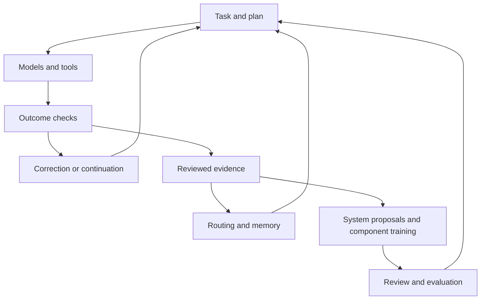

# How Agent Forge works

Agent Forge is an orchestration system that carries a goal through planning, model selection, tool work, review, and correction. Building and using that system also creates a growing body of material for training its own components. The useful unit of experience is a decision made in context, followed by evidence of what happened.

This guide describes production concepts reviewed on October 5, 2026. The [public core](PUBLIC_CORE.md) is an independently authored reference implementation. The example below is illustrative, not a private conversation or measured production run.

## Follow one piece of work

Suppose someone asks: “Add an export feature to this application, test it, and document how it works.” They later say “include the filters” and “and the tests?” Those short messages carry the earlier goal, constraints, and unfinished work forward.

| Stage | What Agent Forge brings to the task | Why it matters |
|---|---|---|
| Understand the work | Request classification, existing task state, retrieved context, and a primary chat owner | A short continuation can still require substantial action |
| Decide the execution shape | Direct execution or a more involved planning and specialist path | Prompt length alone does not establish the need for a council |
| Construct a plan | Deliverables, dependencies, capability requirements, and review constraints | Independent work can be split; dependent steps need an order |
| Assign work | Reusable specialist responsibilities mapped to compatible models and backends | A coding worker can keep its job while the available model changes |
| Execute and observe | Tools, governed actions, model-call records, progress events, and persistent state | A proposed edit, an approved edit, and an executed edit are different events |
| Check delivery | Completion state, tool outputs, observed files, and plan status | “I will add tests” does not establish that tests were added or run |
| Preserve experience | Eligible outcome evidence, corrections, proposal history, and curated decision examples | Later routing, memory, and component training can use different parts of the record |

There are two connected feedback loops:

The first loop completes the user's work. The second improves how future work is handled. A decision in the second loop still needs its own evidence and authority.

## The council creates one coherent plan

The role names preserve the project's design philosophy: creation, preservation, and challenge. In practical terms:

| Role | Responsibility |
|---|---|
| Bodha | Identify what should be created and which deliverables matter |
| Dharma | Translate that intent into executable steps, dependencies, and model capability requirements |
| Tapas | Challenge unnecessary work, examine constraints, and identify what needs verification |

The current planning path runs those roles in order and reconciles their contributions into one plan. Coverage and dependency checks can require repair before execution. Dharma describes the capability a step needs; routing chooses a compatible model instance. This makes the plan less dependent on today's model catalogue.

These responsibilities are useful to copy into your own design. Three model responses alone do not establish a valid plan: check coverage, dependencies, conflicts, and evidence at the boundary where the plan becomes executable.

## Context is the state of the work

For Agent Forge, useful context includes the goal, current step, relevant earlier decisions, artifacts, corrections, and outcome history. Retrieval connects the current task to builder logs, previous proposals, task patterns, or domain knowledge on selected paths.

That motivates learning **same task / related task / different task** and **continuation / trivial message**. Similar wording can refer to different projects. A two-word follow-up can refer to a large unfinished task. Relevant context and correct task identity matter alongside the size of a model's context window.

## The Architect remembers why a change was rejected

The Architect inspects the system and produces reviewable improvement proposals. It draws on build context, learned rules, and proposal memory. Approved, rejected, and modified proposals can be retained; rejection reasons help prevent the same unwanted change being proposed again.

A proposal has a lifecycle. Approval is distinct from successful execution. Edit preflight and dry-run information support review, but do not by themselves establish that the resulting system compiles or passes tests. The improvement still needs validation appropriate to the change.

## Observation becomes a question before it becomes an action

The implemented Python watcher listens to workflow events and asks typed questions through the shared decision service: is this work complete, did this step finish, does a failure need recovery, or which part caused it? It runs outside the main turn's work through bounded queues and records its assessments in logged-only mode.

This lets the team examine the questions, answers, and eventual outcomes before changing policy. It does not autonomously repair the application. A separate local-model watcher remains a research direction: its proposed role is to notice issues and ask questions, with actions handled through existing control systems.

## The system produces the material it learns from

The founder's one-to-two-day structural planning and build cycles include research, design disagreement, implementation, review, and corrections. Those episodes preserve how a decision changed when new evidence arrived. Runtime turns add plans, tool results, completion information, and model attribution.

The corpus pipeline draws different examples from this material: requests with previous context, executed turns, plan steps, and task pairs. It records missing or shortened evidence, keeps review decisions, checks for sensitive data and test contamination, and guards evaluation holdouts. Model-generated labels remain subject to review and outcome checks; success at the end of a turn does not prove every intermediate judgment was correct.

The [behavior evaluation guide](BEHAVIOR_EVALUATION.md) explains the targeted decisions and measured candidates. The [learning map](LEARNING_SYSTEMS.md) distinguishes routing adaptation, memory, retrieval training, and decision training. The [builder guide](BUILD_YOUR_OWN.md) turns these ideas into reusable component contracts.
