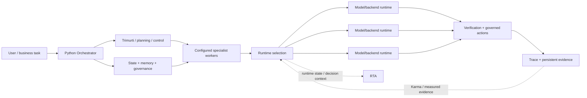

# Production capabilities — public view

Agent Forge is a deployed multi-model orchestration system. This page describes production responsibilities at a deliberately high level. It does **not** reproduce production source, prompts, worker definitions, routing weights, thresholds, provider credentials, endpoint configuration, deployment topology, private traces, or customer/runtime data.

## The core idea

Agent Forge separates **control-plane subsystems**, **reusable configured specialist workers**, and **replaceable model/backend execution resources**.

The system does not assume that one flagship model should handle every request, and it does not model every control component as the same kind of generic agent. Python control/intelligence subsystems can coordinate the lifecycle, deliberation, validation, state, routing intelligence, and runtime conditions; configured workers can own reusable specialist responsibilities; compatible runtimes can then execute work without becoming the organizational identity of the worker.

The separation matters: control systems, worker responsibility, runtime execution, authority, and evidence can evolve independently.

## Public map of production responsibilities

| Capability | What it means publicly |
|---|---|
| Multi-model orchestration | A request can be classified, decomposed, delegated, synthesized, governed, and verified across compatible execution resources. |
| Python Orchestrator | A dedicated control system owns the request lifecycle and wires routing, memory, Trimurti, tools, and worker creation/dispatch. |
| Configured specialist workers | Reusable configured workers can be instantiated and dispatched for specialist work without being permanently identified with one runtime. |
| Evidence-aware routing | Selection can consider declared capability plus live operating information and accumulated evidence rather than a fixed favorite model. |
| Provider/runtime abstraction | Execution resources sit behind compatible interfaces so orchestration does not become one provider-specific application. |
| Trimurti | A Python deliberation subsystem with per-request and background responsibilities, memory, sentinel integration, and pipeline components. |
| Sentinel gates | Validation/gating machinery can inspect selected control boundaries rather than treating generated output as automatically acceptable. |
| Karma | Monitoring plus outcome/capability evidence can inform routing and system-health decisions. |
| RTA | Runtime-state and decision machinery covers backend lifecycle, flow/capacity, and strategy responsibilities. |
| Persistent context, plans, and checkpoints | Conversations, projects, plans, checkpoints, retrieval, and memory can survive beyond a single model call. |
| Governed tools | Runtime selection does not itself grant authority to act; consequential actions can be scoped, reviewed, approved, and audited separately. |
| Delegation and worker spawning | Specialist work can be dispatched through bounded worker/delegation paths, including parallel work where appropriate. |
| Cost governance | Execution can be bounded by spend and resource constraints instead of optimizing only for nominal model quality. |
| Failure handling | Timeouts, health signals, circuit state, cancellation, compatible fallback, and explicit terminal states prevent silent success assumptions. |
| Evaluation and observability | Traces, structured outcomes, ratings, and evaluation signals provide inspectable evidence about what happened. |
| Protocol interoperability | Tool and agent interoperability can sit behind controlled interfaces rather than being hard-wired into the orchestration core. |
| Structured outputs and artifacts | Results can be validated as structured state or immutable artifacts rather than accepted only as free-form text. |
| Prompt lifecycle | Prompt behavior can be treated as versioned application state; production prompt content remains private. |
| Response reuse | Reusable results can be cached behind bounded validity rules rather than forcing every repeat request through fresh inference. |

## How the responsibilities fit together

A useful public grouping is:

| Layer | Representative responsibilities |
|---|---|
| Experience | Chat, projects, files, structured work, operator state, approvals |
| Control plane | Orchestrator lifecycle, planning, deliberation, dispatch, governance |
| Validation | Sentinel gating, verification, artifact/state checks, terminal correctness |
| Specialist workers | Reusable configured worker responsibilities and delegated specialist execution |
| Routing intelligence | Eligibility, selection, Karma evidence, RTA runtime state/decision context |
| Execution | Runtime/provider adapters, tools, compatible fallback, structured outputs |
| State | Memory, retrieval, persistent plans, checkpoints, artifacts, run/session state |
| Quality | Evaluation, tracing, health evidence, explicit terminal states |
| Interoperability | Controlled tool and agent protocol boundaries |

These are responsibility groups, not a disclosure of private package structure or execution policy.

## Conceptual layers

### Orchestrator

The Orchestrator is a Python control system that owns the request lifecycle and coordinates the systems needed to carry work from intake through execution and terminal state. It is not simply a configured specialist worker and is not synonymous with the model that performs inference.

### Trimurti and sentinels

Trimurti is a deliberation subsystem rather than merely a label for a review prompt. Publicly, it is accurate to describe per-request/background deliberation responsibilities, memory, sentinel integration, and pipeline components without publishing private deliberation instructions.

Sentinel gates are validation/gating machinery at selected boundaries. They remain distinct from reusable specialist workers.

### Configured specialist workers

Production has a reusable configured-worker layer. Worker responsibility and execution runtime remain separable: a specialist responsibility need not permanently map to one provider/model identity.

The exact production worker inventory and definitions remain private. The public executable proof uses synthetic worker definitions solely to demonstrate the boundary.

### Karma and RTA

Karma is broader than a success/failure counter: it includes monitoring and outcome/capability evidence that can inform routing and health-related decisions.

RTA is broader than a routing signal: it is a runtime-state/decision subsystem with backend lifecycle, flow/capacity, and strategy responsibilities.

The public repository describes these responsibilities without reproducing their private algorithms, thresholds, feature construction, or learned state.

### Runtime selection

Routing narrows to eligible execution paths and ranks compatible resources using bounded information. The private production policy — including exact weights, thresholds, prompts, inventories, learned parameters, and fallback policy — is intentionally not published.

### Governance and verification

Model confidence and execution authority are separate concerns. Consequential actions can require explicit authority, and completed work can be verified before the system records a terminal outcome.

### Persistent evidence

Successful and failed executions, traces, evaluations, ratings, capability observations, and health information can provide measured evidence for later decisions. Evidence is scoped and bounded rather than treated as unquestioned truth.

## Inspect executable public evidence

[EXECUTABLE_PROOF.md](EXECUTABLE_PROOF.md) demonstrates the control/configured-worker/runtime separation with independently authored, deterministic, provider-neutral code. The worker definitions, runtimes, and evidence values used there are synthetic.

[`../examples/specialist_routing_trace.json`](../examples/specialist_routing_trace.json) remains a compact synthetic trace of runtime selection, authority, verification, and feedback.

Neither artifact contains real production scores, provider inventory, thresholds, prompts, telemetry, private worker definitions, or learned routing parameters.

## What this repository proves

The runnable package in `src/agent_forge_public/` independently implements public control-plane patterns with deterministic, offline fixtures. It is intentionally not a copy of production. Reviewers can inspect lifecycle contracts, routing, fallback, governance, artifacts, events, tenant state, dependency-aware workflows, and the explicit configured-worker/runtime separation without receiving proprietary production policy.

For implementation-level public evidence, continue with `EXECUTABLE_PROOF.md`, `PUBLIC_CORE.md`, `SYSTEM_WALKTHROUGH.md`, `QUALITY_EVIDENCE.md`, and `FAILURE_MODEL.md`.

## Publication boundary

This page is descriptive, not a production specification. Names of public architectural concepts may match the deployed product, but implementation details remain private. In particular, this repository does not publish production source/history, secrets, internal endpoints, deployment identifiers, provider credentials, prompt text, private worker definitions, routing weights or thresholds, private telemetry, customer/session data, or unmerged production work.

The synthetic examples and public control-plane code are intentionally independent representations. They should be read as evidence of the architecture and engineering approach, not as a specification from which the private production engine can be reconstructed.
