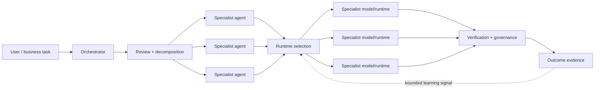

# Production capabilities — public view

Agent Forge is a deployed multi-model orchestration system. This page describes production responsibilities at a deliberately high level. It does **not** reproduce production source, prompts, routing weights, thresholds, provider credentials, endpoint configuration, deployment topology, private traces, or customer/runtime data.

## The core idea

Agents have responsibilities; models are execution resources.

Agent Forge does not assume that one flagship model should handle every request. The orchestration layer can classify work, coordinate agents, discover compatible execution paths, select among available runtimes, verify outcomes, and feed bounded outcome evidence back into later decisions.

The separation matters: an agent's role can remain stable while the model or runtime underneath it changes as capability, health, availability, cost, latency, limits, and prior outcomes change.

## Public map of production responsibilities

| Capability | What it means publicly |
|---|---|
| Multi-model orchestration | A single request can be routed, decomposed, delegated, synthesized, and verified across compatible execution resources. |
| Evidence-aware routing | Selection can consider declared capability plus live operating signals and accumulated outcome evidence rather than a fixed favorite model. |
| Agent coordination | Complex work can be decomposed into dependency-aware tasks and coordinated across specialist agents. |
| Trimurti review | Selected significant work can receive bounded multi-perspective review before or during execution. |
| Karma evidence | Model/runtime outcomes contribute evidence that can influence later selection without being treated as infallible truth. |
| RTA signals | Additional runtime-selection context helps distinguish the role being performed from the execution slot used to perform it. |
| Persistent context | Conversations, projects, checkpoints, retrieval, and memory can survive beyond a single model call. |
| Governed tools | Runtime selection does not itself grant authority to act; consequential actions can be scoped, reviewed, approved, and audited separately. |
| Cost governance | Execution can be bounded by spend and resource constraints instead of optimizing only for nominal model quality. |
| Failure handling | Timeouts, health signals, circuit state, cancellation, compatible fallback, and explicit terminal states prevent silent success assumptions. |
| Evaluation and observability | Traces, structured outcomes, ratings, and evaluation signals provide inspectable evidence about what happened. |
| Protocol interoperability | Tool and agent interoperability can sit behind controlled interfaces rather than being hard-wired into the orchestration core. |
| Structured outputs and artifacts | Results can be validated as structured state or immutable artifacts rather than accepted only as free-form text. |

## Conceptual layers

### Orchestrator

The orchestrator owns the request lifecycle. It assembles context, decides whether work is simple or requires coordination, scopes the work, dispatches execution, and returns explicit state to the product surface.

### Agents

Agents represent responsibilities and operating boundaries. They are not aliases for particular LLMs. A coding, research, analysis, document, media, or business-workflow role can use a different compatible runtime when the operating evidence favors it.

### Runtime selection

The routing layer narrows to eligible execution paths and ranks them using bounded signals. The private production policy — including exact weights, thresholds, prompts, inventories, and learned parameters — is intentionally not published.

### Review, governance, and verification

Model confidence and execution authority are separate concerns. Selected work can be reviewed before execution; consequential actions can require explicit authority; completed work can be verified before the system records a terminal outcome.

### Outcome evidence

Successful and failed executions produce evidence for later decisions. Evidence is scoped and bounded: it informs routing but does not become an unquestioned truth source.

## What this repository proves

The runnable package in `src/agent_forge_public/` independently implements the public control-plane pattern with deterministic, offline fixtures. It is intentionally not a copy of production. Reviewers can inspect and execute lifecycle contracts, routing, fallback, governance, artifacts, events, tenant state, and dependency-aware workflow behavior without receiving proprietary production policy.

For implementation-level public evidence, continue with `PUBLIC_CORE.md`, `SYSTEM_WALKTHROUGH.md`, `QUALITY_EVIDENCE.md`, and `FAILURE_MODEL.md`.

## Publication boundary

This page is descriptive, not a production specification. Names of public architectural concepts may match the deployed product, but implementation details remain private. In particular, this repository does not publish production source/history, secrets, internal endpoints, deployment identifiers, provider credentials, prompt text, routing weights or thresholds, private telemetry, customer/session data, or unmerged production work.