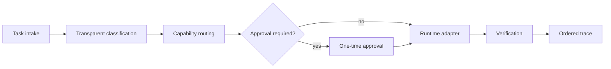

# Runnable Public Core

The public core is a compact, provider-neutral reference implementation of the Agent Forge operating model. It is executable evidence of orchestration engineering, not a copy of the private product and not production policy.

## What it demonstrates

- transparent task classification with inspectable evidence;
- capability-aware runtime selection with an explained score breakdown;
- unavailable and incompatible runtime exclusion;
- explicit approval boundaries for write, execute, and network actions;
- one-time approval challenges with replay rejection;
- deterministic runtime adapters that need no account or API key;
- ordered lifecycle traces and atomic JSON checkpoints;
- dependency validation and parallel execution of independent task waves;
- a standard-library-only Python package, CLI, example, and unit suite.

## Run it

Python 3.11 or newer is the only runtime dependency.

```bash
python -m pip install -e .
agent-forge-public route "Implement and verify a Python parser"
agent-forge-public demo --action write --approve "Implement and verify a Python parser"
python -m unittest discover -s tests_python -v
```

The demo prints structured JSON. A side-effecting task first enters `approval_required`; execution continues only after the exact one-time challenge is consumed. The bundled adapters are deterministic simulations, so the command never calls an external model or service.

## Lifecycle



`AgentForge` composes the lifecycle. `RuntimeRegistry` keeps selection separate from execution. `ApprovalGate` keeps model choice separate from authority. `TraceRecorder` makes every stage inspectable. `TaskGraph` and `GraphDispatcher` show how independent work can run concurrently while dependency order remains explicit.

## Deliberate public substitutions

| Production concern | Public-core representation |
|---|---|
| Model and provider integrations | Deterministic local adapters with neutral names |
| Proprietary routing policy | Small documented scoring example |
| Internal prompts and agent instructions | Plain user-supplied task text only |
| Operational permissions | Self-contained one-time approval gate |
| Durable application state | Atomic JSON checkpoint example |
| Private telemetry | In-memory ordered trace events |

These substitutions preserve architectural relationships while withholding implementation details that would expose operational or proprietary behavior. The public implementation is independently authored for this repository and should not be interpreted as the production source, its exact configuration, or its decision policy.

## Code map

| Module | Responsibility |
|---|---|
| `classification.py` | Derive task capabilities and retain human-readable evidence |
| `routing.py` | Filter candidates and produce an explained route decision |
| `governance.py` | Pause consequential actions and reject approval replay |
| `runtime.py` | Register adapters behind a narrow execution interface |
| `orchestrator.py` | Coordinate intake, routing, governance, execution, and verification |
| `dispatch.py` | Validate dependency graphs and execute ready tasks concurrently |
| `checkpoint.py` | Save and load path-safe, atomic JSON checkpoints |
| `tracing.py` | Record ordered, thread-safe lifecycle evidence |
| `cli.py` | Expose routing and governed execution from the terminal |

The public boundary and automated scanner are documented in [PUBLIC_BOUNDARY.md](PUBLIC_BOUNDARY.md).
