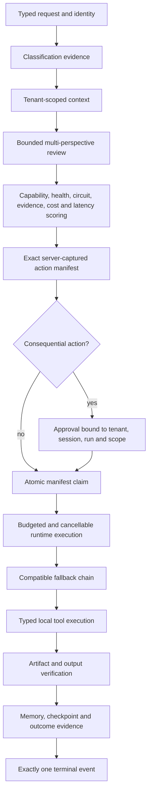

# Runnable Public Control Plane

This package is independently authored, provider-neutral executable evidence of the Agent Forge operating model. It is intentionally smaller than the private application, but it is not a two-line mock: it implements the control relationships that make orchestration difficult to do safely.

It contains no provider credential, external model call, private prompt, production policy, or copied application source.

## Run the four system scenarios

Python 3.11 or newer is the only runtime dependency.

```bash
python -m pip install -e .
agent-forge-public lab all
python -m unittest discover -s tests_python -v
```

`lab all` exercises:

| Scenario | Evidence produced |
|---|---|
| `happy` | classification, evidence-scored routing, execution, tool claim, verification, memory, checkpoint, one terminal event |
| `fallback` | transient primary failure, recorded attempt, compatible fallback, budget commit, successful completion |
| `governed` | review findings, exact-action manifest, approval pause, artifact creation, immutable reference, verification |
| `rejected` | operator denial, cancellation, rejected capability, zero action execution |

The JSON output includes every route candidate, exclusion or score component, attempt, action result, verification result, and lifecycle event.

## End-to-end lifecycle



Selection is not authority. Approval is not execution. Execution is not completion. The code makes each boundary explicit and testable.

## Implementation map

| Module | Responsibility | Important invariant |
|---|---|---|
| `contracts.py` | Typed request, runtime, route, action, attempt, result and artifact contracts | Completed results must be terminal |
| `events.py` | Append-only lifecycle journal | Nothing may emit after the first terminal event |
| `control.py` | Cancellation, deadlines, circuits, budget reservation, capacity and outcome evidence | Operational controls are tenant-aware and concurrency-safe |
| `selection.py` | Explained eligibility filtering and evidence scoring | Incompatible, unavailable, open-circuit or unauthorized runtimes cannot win |
| `adapters.py` | Neutral deterministic runtimes and scripted failures | Resilience behavior is reproducible without a service account |
| `execution.py` | Bounded attempts, fallback, cost accounting and feedback | Every reservation is committed or released |
| `review.py` | Bounded creation, preservation, risk and verification perspectives | Governance-bypass requests stop before routing |
| `manifests.py` | Exact-action approval registry | Approval is bound to action fingerprint, tenant, session, run and scope |
| `actions.py` | Typed safe-local tools | Only an atomically claimed manifest can execute |
| `state.py` | Tenant memory, checkpoints, run states and immutable artifacts | Reads cannot cross a tenant boundary |
| `streaming.py` | Delta, heartbeat, inactivity and terminal stream contracts | Partial output survives a stall and every stream terminates exactly once |
| `task_state.py` | Tenant-scoped vector-space and similarity contracts | Dimensions, vector space and tenant identity must match before retrieval |
| `protocols.py` | Neutral MCP/A2A capability envelopes | Only registered protocols and declared capabilities may be invoked |
| `workflow_graph.py` | DAG validation and parallel wave scheduler | Topology and dependency failure context are preserved |
| `control_plane.py` | Full vertical slice | Failure, cancellation and success terminalize both run and action capability |
| `scenarios.py` | Recruiter-readable system demonstrations | Happy, degraded, governed and denied paths stay deterministic |
| `cli.py` | Terminal entry point | Detailed evidence is available without a GUI clone |

`PublicControlPlane` is the one supported orchestration entry point. The CLI, scenarios and example all use it, so the repository does not present a second simplified implementation as a competing source of truth.

## What the test suite proves

The standard-library unit suite covers more than happy paths. It asserts:

- tenant/session/run/scope ownership binding;
- canonical action fingerprints and exact payload comparison;
- idempotent pending approval reuse and terminal replay suppression;
- a single winner under concurrent manifest claims;
- expired and completed approval behavior;
- one terminal event and late-event rejection;
- tenant-scoped memory, circuits, outcome evidence and artifacts;
- tenant-qualified budget reservations even when different tenants reuse a run identifier;
- atomic budget reservation and capacity release;
- capacity contention without corrupting runtime-health or circuit evidence;
- transient fallback and permanent-failure stop behavior;
- runtime compatibility, health, circuit and tool-authority exclusions;
- approval pause, rejection without side effects and manifest terminalization;
- stored-byte artifact integrity, exact expected-name matching, memory persistence and checkpoint creation;
- partial-preserving inactivity cutoff, early-EOF detection and exactly one stream terminal;
- tenant-scoped vector retrieval with strict space and dimension contracts;
- registered protocol and declared-capability enforcement;
- DAG cycle detection, parallel waves, downstream skips and failure context.

See [SYSTEM_WALKTHROUGH.md](SYSTEM_WALKTHROUGH.md) for a narrated run, [QUALITY_EVIDENCE.md](QUALITY_EVIDENCE.md) for the claim-to-test map, [decisions/README.md](decisions/README.md) for the architecture decisions, and [FAILURE_MODEL.md](FAILURE_MODEL.md) for the operational contract.

## Deliberate public substitutions

| Private-system concern | Safe public representation |
|---|---|
| Runtime and provider integrations | Deterministic adapters with neutral names |
| Proprietary routing and review policy | Small, labeled, documented demonstration policy |
| Internal instructions and prompts | Rule-based review using only supplied task text |
| Durable service-backed state | Thread-safe in-memory contracts and immutable references |
| Real network and tool side effects | Typed inspect, artifact and simulated-network tools |
| Private telemetry and evaluation data | Synthetic per-tenant outcome counters and ordered events |
| Distributed execution infrastructure | Local bounded fallback and DAG scheduling |

These substitutions preserve architectural relationships while withholding operational details. The precise inclusion and exclusion rationale is in [PUBLIC_IMPLEMENTATION_MAP.md](PUBLIC_IMPLEMENTATION_MAP.md), and the automated publication rules are in [PUBLIC_BOUNDARY.md](PUBLIC_BOUNDARY.md).
